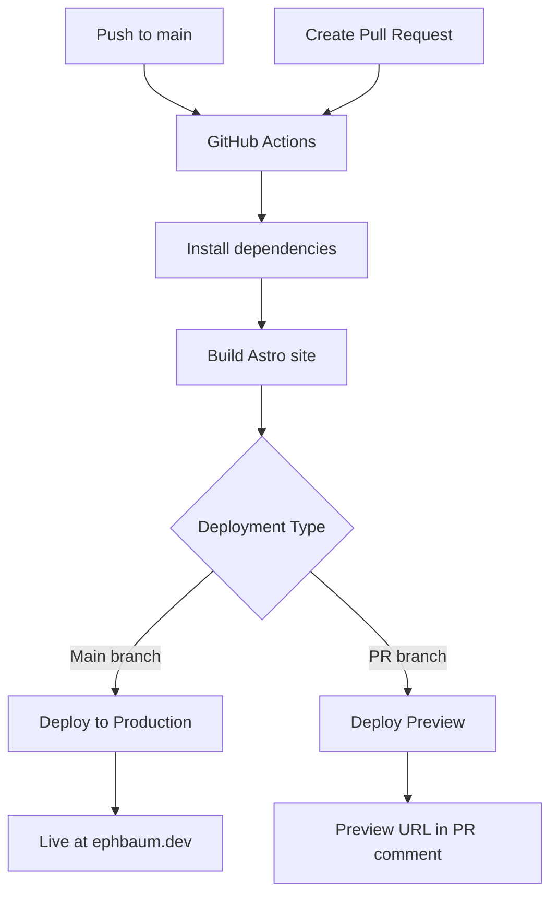

# Eph Baum dot Dev

A personal blog built with Astro and a brutalist theme, migrated from Ghost CMS to a modern static site generator.

## 🎯 About

A blog where I talk to myself to answer my own questions about tech, engineering, and working with people. This site was migrated from a Ghost blog running on Digital Ocean to a static Astro site for better performance, lower costs, and easier maintenance.

This is a heavily modified version of the [Brutal](https://github.com/eliancodes/brutal) neobrutalist Astro theme, customized for my personal use but available for others who want a more feature-rich brutalist blog setup.

## 🚀 Tech Stack

- **[Astro](https://astro.build/)** - Static site generator with optimized asset pipeline
- **[UnoCSS](https://unocss.dev/)** - Atomic CSS engine with `@unocss/preset-wind3` (Tailwind v3 compatible)
- **[Brutal UI](https://github.com/eliancodes/brutal-ui)** - Brutalist design system
- **[TypeScript](https://www.typescriptlang.org/)** - Full type safety
- **[pnpm](https://pnpm.io/)** v10.12.4 - Fast, disk space efficient package manager
- **[asdf](https://asdf-vm.com/)** - Version management for Node.js and pnpm
- **[Sharp](https://sharp.pixelplumbing.com/)** - High-performance image processing for OG images

## 🎨 Theme Foundation

This blog is built on the **[Brutal](https://github.com/eliancodes/brutal)** neobrutalist Astro theme by [Elian Codes](https://www.elian.codes/), which provides:

- **Neobrutalist Design** - Minimalistic and functional aesthetic
- **No JavaScript by default** - Pure static generation approach
- **UnoCSS Integration** - Utility-first CSS with TailwindCSS compatibility
- **Built-in SEO** - Automatic sitemap, RSS feed, and image optimization
- **16 Color Palette** - Predefined brutalist colors (red, blue, green, yellow, pink, purple, orange, teal, cyan, lime, emerald, fuchsia, violet, rose, sky, amber)

### 🚀 My Customizations & Enhancements

I've significantly evolved the base theme with these improvements:

| **Base Theme** | **My Enhanced Version** | **Benefits** |
|---|---|---|
| Basic Astro setup | **TypeScript integration** | Full type safety and better DX |
| Simple markdown posts | **Advanced content management** | Structured blog with tags, metadata |
| Basic image handling | **OG image generation** | Automatic social media previews |
| Standard RSS feed | **Enhanced RSS + sitemap** | Better SEO and content discovery |
| Basic styling | **Custom brutalist components** | Unique design system |
| No version management | **asdf + pnpm setup** | Consistent development environment |
| Basic deployment | **GitHub Actions + Vercel ready** | Automated CI/CD pipeline |
| Ghost migration | **Complete CMS migration** | Preserved content and SEO |
| Security baseline | **Regular security updates** | Astro 4.16.19 with latest patches |

## 🛠️ Development Setup

### Prerequisites

- [Node.js](https://nodejs.org/) (managed via asdf)
- [pnpm](https://pnpm.io/) (managed via asdf)
- [asdf](https://asdf-vm.com/) for version management

### Installation

1. **Clone the repository**
   ```bash
   git clone https://github.com/ephbaum/ephbaumdotdev.git
   cd ephbaumdotdev
   ```

2. **Install dependencies**
   ```bash
   pnpm install
   ```

3. **Start development server**
   ```bash
   pnpm run dev
   ```

4. **Open your browser**
   Navigate to [http://localhost:4321](http://localhost:4321)

### Available Scripts

Based on the original Brutal theme with our enhancements:

| Command | Action | Notes |
|---------|--------|-------|
| `pnpm run dev` | Start local dev server at `localhost:4321` | Enhanced with TypeScript support |
| `pnpm run build` | Build production site to `./dist/` | Includes OG image generation |
| `pnpm run preview` | Preview build locally before deploying | Test production build |
| `pnpm run astro` | Run Astro CLI commands | Full CLI access |
| `pnpm run astro --help` | Get help using the Astro CLI | Documentation |
| `pnpm run new-post` | Create a new blog post with frontmatter | Interactive script for content creation |
| `pnpm run check-metadata <image>` | Check what metadata exists in an image | Shows what will be stripped on commit |
| `pnpm run strip-metadata <image>` | Strip EXIF metadata from an image | Removes GPS, camera data; keeps orientation |
| `pnpm run bulk-strip-metadata [--dry-run]` | Strip metadata from ALL images | One-time cleanup of existing images |
| `pnpm run bulk-add-copyright [--dry-run]` | Add copyright to ALL images | Alternative: Strip + add your copyright |

## 📁 Project Structure

```
src/
├── assets/             # Astro asset pipeline (processed images)
│   └── img/           # Images processed by Astro (optimized, WebP conversion)
│                      # Used by: Blog post imgUrl fields, <Image> component
│                      # Example: ../../../../assets/img/ephbaum_dot_dev.png
├── components/          # Reusable UI components
│   ├── blog/          # Blog-specific components (from base theme)
│   ├── errors/        # Error pages like 404 (from base theme)
│   ├── generic/       # Reusable components (from base theme)
│   ├── home/          # Homepage components (from base theme)
│   └── layout/        # Header, footer, head sections (from base theme)
├── content/            # Blog posts and content
│   └── blog/          # Markdown blog posts with frontmatter
│       └── YYYY/MM/   # Organized by year and month
├── layouts/           # Page layouts
│   ├── Default.astro  # Base layout with props system
│   └── BlogPost.astro # Blog-specific layout
├── pages/             # File-based routing
│   ├── blog/         # Blog listing and individual posts
│   ├── v1/generate/  # OG image generation (custom addition)
│   ├── feed.xml.js   # RSS feed (from base theme)
│   └── index.astro   # Homepage
└── styles/           # Global styles and UnoCSS config

public/
└── img/               # Static assets (served as-is, no processing)
                       # Used by: Direct URLs, OG image generation
                       # Access: /img/filename.png or readFileSync
```

### 📷 Image Asset Management

Understanding where to place images:

**`src/assets/img/`** - **Astro Asset Pipeline**
- ✅ Images processed by Astro's build system
- ✅ Automatic optimization, resizing, and WebP conversion
- ✅ Used in content collections (`imgUrl` fields)
- ✅ Used with Astro's `<Image>` component
- ✅ Import in code: `import img from '@assets/img/photo.png'`
- ❌ Cannot be read with `readFileSync` at build time

**`public/img/`** - **Static Assets**
- ✅ Served directly without processing
- ✅ Direct URL access: `/img/photo.png`
- ✅ Can be read with `readFileSync` (OG image generation)
- ✅ Predictable paths for external references
- ❌ No automatic optimization
- ❌ Not processed by Astro's asset pipeline

**Example:** The avatar `ephbaum_dot_dev.png` exists in both locations:
- `src/assets/img/ephbaum_dot_dev.png` - Used by blog posts (optimized by Astro)
- `public/img/ephbaum_dot_dev.png` - Used by OG image generation (read as-is)

### 🔒 Image Privacy & Metadata

> 📖 **Full Documentation:**
> - [IMAGE_METADATA_GUIDE.md](IMAGE_METADATA_GUIDE.md) - What gets stripped and why
> - [COPYRIGHT_STRATEGY.md](COPYRIGHT_STRATEGY.md) - Strip everything vs. add copyright

**Automated EXIF Stripping on Commit**

A git pre-commit hook automatically strips EXIF metadata (GPS location, camera info, timestamps) from all staged images before they're committed. This ensures:
- No sensitive location data in git history
- Smaller repository size
- Privacy protection

**How it works:**
1. Stage an image: `git add src/assets/img/photo.jpg`
2. Commit: `git commit -m "Add photo"`
3. Hook automatically strips metadata and re-stages the clean image
4. Only clean images get committed

**Requirements:**
- Install `exiftool`: 
  - Ubuntu/Debian: `sudo apt-get install libimage-exiftool-perl`
  - macOS: `brew install exiftool`
- Or use the built-in Sharp script: `pnpm run strip-metadata <image-path>`

**Check and strip manually:**
```bash
# First, check what metadata exists
pnpm run check-metadata src/assets/img/2025/10/photo.jpg

# Then strip if needed (using Sharp - already in project dependencies)
pnpm run strip-metadata src/assets/img/2025/10/photo.jpg

# Or skip the hook for a specific commit
git commit --no-verify
```

**What's preserved:**
- Image orientation (prevents rotated images)
- ICC color profiles (for color accuracy)

**What's removed:**
- GPS location data
- Camera make/model/settings
- Copyright information
- Creation timestamps
- Software used
- All other EXIF/IPTC/XMP data

### 🎨 Component Architecture

Following the base theme's structure with our enhancements:

- **`components/blog/`** - Blog listing, content, sidebar components
- **`components/errors/`** - 404 page and error handling
- **`components/generic/`** - Reusable components like RecentBlogPosts
- **`components/home/`** - Homepage-specific components
- **`components/layout/`** - BaseHead, BaseNavigation, BaseFooter

## 🎨 Features

- **Static Site Generation** - Fast, secure, and SEO-friendly
- **Brutalist Design** - Bold, functional, and distinctive UI
- **Responsive Layout** - Works on all devices
- **OG Image Generation** - Automatic social media previews using local filesystem (no external dependencies)
- **RSS Feed** - `/feed.xml` for subscribers
- **Sitemap** - Automatic SEO sitemap generation
- **Image Optimization** - Automatic WebP conversion and optimization with Sharp
- **TypeScript** - Full type safety with zero errors/warnings
- **Comprehensive Analytics** - Umami Analytics + Vercel Speed Insights
- **Automated Deployment** - GitHub Actions + Vercel CI/CD
- **Content Migration** - Complete Ghost CMS to Astro migration
- **Build Optimization** - Clean build with 0 errors, 0 warnings, optimized dependencies

### 🎨 Brutalist Color System

The theme includes 16 predefined brutalist colors that can be used throughout the site:

**Primary Colors**: red, blue, green, yellow, pink, purple, orange, teal  
**Secondary Colors**: cyan, lime, emerald, fuchsia, violet, rose, sky, amber

These colors are used in:
- Background sections (`bg-pink`, `bg-green`, `bg-blue`, etc.)
- Component styling
- Page layouts and visual hierarchy
- Maintaining the brutalist aesthetic

## 📝 Content Management

### Creating New Blog Posts

Use the interactive blog post creation tool:

```bash
pnpm run new-post
```

This script will prompt you for:
- **Title** - The blog post title
- **Description** - SEO description for the post
- **Tags** - Comma-separated tags (defaults to 'general' if none provided)
- **Date/Time** - Publication date (defaults to current time if not specified)
- **Draft Status** - Whether the post should be marked as draft

The script automatically:
- ✅ **Generates slug** from the title (URL-friendly format)
- ✅ **Creates directory structure** by year/month (`src/content/blog/YYYY/MM/`)
- ✅ **Generates frontmatter** with all required metadata
- ✅ **Sets up file structure** with proper image paths and layout
- ✅ **Provides template content** with introduction, main content, and conclusion sections

### Blog Post Structure

Blog posts are written in Markdown and stored in `src/content/blog/YYYY/MM/`. Each post includes:

- **Frontmatter** with metadata (title, date, tags, author, etc.)
- **Markdown content** with template structure
- **Automatic OG image generation** for social media
- **SEO optimization** with proper meta tags
- **Draft support** for work-in-progress posts

## 🔒 Security

This project is regularly updated to address security vulnerabilities:

- **Astro 4.16.19** - Latest stable version with security fixes
- **Regular dependency updates** - Automated security patches
- **Static site** - No server-side vulnerabilities
- **Audit workflow** - Regular security scanning

## 🚀 Deployment

### GitHub Actions + Vercel

The site is designed to be deployed as a static site using:

1. **GitHub Actions** - Automated CI/CD pipeline
2. **Vercel** - Fast, global CDN with edge functions
3. **Custom Domain** - `ephbaum.dev`

### Build Process

```bash
pnpm run build
```

This generates optimized static files in the `dist/` directory, ready for deployment.

### 🛠️ Deployment Setup

The site is currently deployed using:

#### **Vercel Configuration**
- ✅ **Vercel Project** - Connected to GitHub repository
- ✅ **Custom Domain** - `ephbaum.dev` with automatic SSL
- ✅ **Build Configuration** - `vercel.json` with Astro framework detection
- ✅ **Automatic Deployments** - Deploys on every push to `main` branch

#### **GitHub Actions Workflow**
- ✅ **Workflow File** - `.github/workflows/deploy-vercel.yml`
- ✅ **GitHub Secrets** configured:
  - `VERCEL_TOKEN` - Vercel authentication token
  - `VERCEL_ORG_ID` - Vercel organization ID
  - `VERCEL_PROJECT_ID` - Vercel project ID
- ✅ **Automated Process** - Builds and deploys on push to `main`
- ✅ **Preview Deployments** - Automatic preview URLs for pull requests

#### **Preview Deployments**
When you create a pull request, Vercel automatically:
- 🚀 **Builds and deploys** your changes to a unique preview URL
- 🔗 **Comments on the PR** with the preview deployment link
- 🧪 **Provides isolated testing** environment identical to production
- 👥 **Enables collaboration** - reviewers can test changes live before merging
- 🗑️ **Auto-cleanup** - preview deployments are removed when PR is closed

### 🔒 Security Considerations

**Why This Setup is Safe:**
- ✅ **Static site only** - No server-side code execution
- ✅ **Public content** - Blog posts are meant to be public
- ✅ **No secrets in build** - Vercel tokens stored in GitHub Secrets
- ✅ **Minimal permissions** - Vercel tokens restricted to project deployment
- ✅ **Encrypted secrets** - GitHub Secrets are encrypted at rest

**What We're Protecting:**
- 🔐 Vercel authentication tokens
- 🔐 Project configuration
- 🔐 Deployment tokens
- 🔐 Any future API keys (if needed)

### 📋 Deployment Workflow



**Automated Process:**
1. **Code Push/PR** → Triggers GitHub Actions
2. **Build** → `npm ci` → `npm run build`
3. **Deploy** → Deploy to Vercel using Vercel Action
4. **Result** → Production site at `ephbaum.dev` OR preview URL for PRs

## 📊 Analytics & Performance Monitoring

This project includes comprehensive analytics and performance monitoring:

### Umami Analytics
- **Custom Event Tracking**: Blog clicks, navigation, external links, color interactions
- **Privacy-first**: No cookies, GDPR compliant, no cross-site tracking
- **Long-term data**: Extended data retention
- **External dashboard**: Dedicated analytics interface
- **Free forever**: No usage limits

### Vercel Speed Insights
- **Core Web Vitals**: Tracks LCP, FID, CLS, FCP, TTFB
- **Real User Monitoring**: Performance data from actual users
- **Built-in dashboard**: Integrated with Vercel project dashboard
- **Production only**: Automatically enabled when deployed to Vercel
- **Privacy compliant**: No personal data collected

### Tracked Events
- **Blog Interactions**: Post clicks, tag clicks
- **Navigation**: Menu navigation, footer links
- **External Links**: Social media and external site clicks
- **RSS Feed**: Feed subscription tracking
- **Color System**: Palette clicks and color scheme changes

### Configuration
- **Umami**: Configured via `PUBLIC_UMAMI_WEBSITE_ID` environment variable
- **Speed Insights**: Automatically enabled in production deployments
- **Cost-effective**: Umami for events, Speed Insights for performance

See [ANALYTICS_EVENTS.md](ANALYTICS_EVENTS.md) for detailed implementation and [UMAMI_SETUP.md](UMAMI_SETUP.md) for technical setup.

## 🔄 Migration from Ghost

This blog was migrated from Ghost CMS, which involved:

- **Database export** - MySQL dump to Markdown conversion
- **Image migration** - Asset optimization and organization
- **URL preservation** - Maintaining existing permalinks
- **SEO preservation** - Keeping search engine rankings

## 🤝 Contributing

This is a personal blog, but suggestions and improvements are welcome:

1. Fork the repository
2. Create a feature branch
3. Make your changes
4. Submit a pull request

## 📄 License & Copyright

### Software License
This project's code, configuration files, and documentation are licensed under the MIT License - see the [LICENSE](LICENSE) file for details.

### Content Copyright
**IMPORTANT**: All blog content, articles, and written material on this site are copyrighted by Eph Baum and are NOT covered by the MIT license. This includes:
- Blog posts and articles
- Personal writings and opinions  
- Original images and graphics created by the author
- Any other creative content

### Third-Party Content
Any copyrighted material from third parties (images, quotes, references, etc.) used on this site is used under fair use standards for commentary, criticism, education, and news reporting purposes.

### Usage Rights
You may not reproduce, distribute, or use the blog content without explicit written permission from the copyright holder.

## 📋 Documentation

- **Project Status**: [PROJECT_STATUS.md](PROJECT_STATUS.md) - Comprehensive project overview
- **Analytics Setup**: [ANALYTICS_EVENTS.md](ANALYTICS_EVENTS.md) - Complete analytics implementation guide
- **Umami Configuration**: [UMAMI_SETUP.md](UMAMI_SETUP.md) - Umami technical setup
- **Theme Documentation**: [BRUTAL_THEME_README.md](BRUTAL_THEME_README.md) - Base theme information

## 🔗 Links

- **Live Site**: [ephbaum.dev](https://ephbaum.dev)
- **Repository**: [github.com/ephbaum/ephbaumdotdev](https://github.com/ephbaum/ephbaumdotdev)
- **Author**: [Eph Baum](https://ephbaum.dev)

---

*Built with ❤️ using Astro and deployed with Vercel*