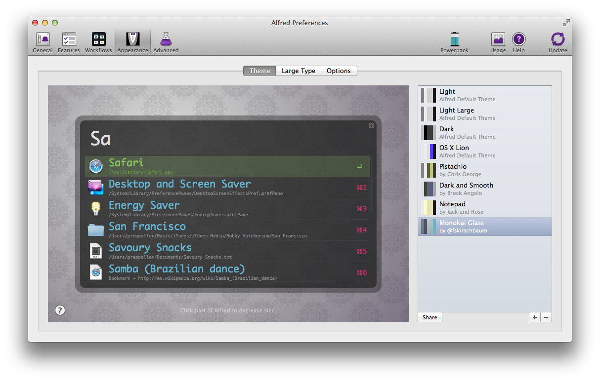
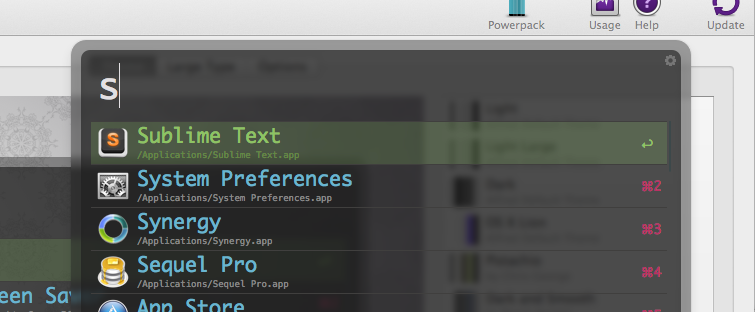

_... and the Monokai Glass Theme._

Alfred Logo

If you're a Mac user and you're not using [Alfred](http://alfredapp.com) then you're not nearly as efficient as you could be. The advantage of using a GUI based OS is that you don't have to type all of your commands into a terminal and you can interact in a more visual way with your computer. The advantage of a terminal based OS is that you can get things done quickly without all that messy mouse business that takes your hands away from your keyboard.

Alfred gives you a nearly perfect blend of these things by allowing you to get more done without a mouse while simultaneously cutting down on the amount of both typing and mousing you needed to get things done.

> Also, it's beautiful.

Alfred was recommended to me as the first thing to install on my brand new, just out of the box, Mac Book Pro Retina by my good friend [Nicholas](http://twitter.com/niczak/). I have been using Alfred since then and find myself hitting `[Alt+Space]` hundreds of times a day to get about my OS which is just so pleasing.

So, recently I made the decision to invest in the [PowerPack](http://www.alfredapp.com/powerpack/) after having been on the fence for quite a while. It was a difficult decision for me simply because the cost does not land in a comfortable sweet spot that I would expect for an application of this type. It would have been a no-brainer had it been $20(USD), if that were the case I would have pulled the trigger then in a heartbeat and never looked back. However, the price is £17(GBP) which generally equates to about ~$30(USD). Being a foreign (to me) currency, there's invariably a cost to convert USD to GBP as well that has to be considered.

In the end I made the investment and I am truly glad to have done so. I will definitely be sharing some of my new workflows in the future because of how much time they have already saved for me. For now, though, I'll just describe a couple of _for instances_.

#### SVN

One of the tasks that I do repetitively is update my SVN repos for various projects at work. While I don't want to get into a discussion about SVN and why anyone would ever use it instead of a solution like, say, Git, I will say that it's not up to me.

Regardless. Before I paid for the PowerPack and unlocked workflows in Alfred, my workflow looked like this:

`[Alt+Space]`

it (chooses iTerm)

`[Return]`

`$>cd Sites/echo/`

`$> svn update dev/ alpha/`

Now my workflow looks like this:

`[Alt+Space] ech`

(chooses 'echoup')

`[Return]`

That's a pretty decent savings from a keystroke perspective. It doesn't need to open the terminal, it just issues the `svn` update command for me.

#### `[Windows + L]`

I walk away from my computer throughout the day and when I do I like to lock it. Now, without Alfred I honestly have no idea how I would do this. I know you can click the Apple menu in the upper left of the toolbar and 'Restart' or 'Sleep' but I don't know where a lock option is. Without the Alfred PowerPack I could just do this:

`[Alt+Space] lo`

(chooses 'Lock')

`[Return]`

And away we go.

Now with the PowerPack I can simply do this:

`[Alt+Cmd+L]`

Very similar to a Windows machine's `[Win+L]`.

#### Themes!!!

I am nothing if not a lover of all things visual. I want my User Experience to be pretty all the time. And, my favorite visual theme for most everything is '[Monokai](https://www.google.com/images?q=monokai%20theme)'. This, of course, that means that I needed Alfred to be Monokai Themed as well and since I didn't find one that had been created the way I wanted it to be, I made my own:

Alfred Preferences Showing Monokai Glass Theme

And it looks especially handsome with the '[Blur](http://www.alfredforum.com/topic/289-cheeky-little-transparency-blur-hack-for-themes/)' hack that you can do:

Alfred with Monokai Glass Theme and Blur Hack

If you would like to use my Monokai Glass theme, you can simply click or copy this link. Which will either open in Alfred or you can open Alfred and paste the link in and it will import the theme for you. Because I suspect that there may be some trouble somewhere with browsers parsing this particular URI, you can copy and paste from the code below as well:

    alfred://theme/searchForegroundColor=rgba(227,225,227,1.00)&resultSubtextFontSize=0&searchSelectionForegroundColor=rgba(255,255,255,1.00)&separatorColor=rgba(64,63,62,1.00)&resultSelectedBackgroundColor=rgba(141,196,100,0.20)&shortcutColor=rgba(186,49,98,1.00)&scrollbarColor=rgba(60,72,74,1.00)&imageStyle=8&resultSubtextFont=Menlo&background=rgba(31,31,31,0.65)&shortcutFontSize=1&searchFontSize=4&resultSubtextColor=rgba(135,135,135,1.00)&searchBackgroundColor=rgba(0,0,0,0.00)&name=Monokai%20Glass&resultTextFontSize=3&resultSelectedSubtextColor=rgba(99,136,68,1.00)&shortcutSelectedColor=rgba(141,196,100,1.00)&widthSize=3&border=rgba(31,31,31,0.40)&resultTextFont=Monaco&resultTextColor=rgba(104,181,209,1.00)&cornerRoundness=0&searchFont=Monaco&searchPaddingSize=0&credits=%40fskirschbaum&searchSelectionBackgroundColor=rgba(102,122,140,1.00)&resultSelectedTextColor=rgba(141,196,100,1.00)&resultPaddingSize=2&shortcutFont=Monaco

#### In closing...

I am in love with Alfred, and I'm not afraid of who knows it. It's absolutely worth the money, though I think they should reduce the price just a [smidgen](https://www.google.com/search?q=define%20smidgen). I think this without any data at all, I'm just making a wild assumption that they'd sell more at a slightly lower price.

If you're any kind of 'power user' on a Mac this is an absolute **must** for your arsenal. Get more done while doing less work is always worth it.
