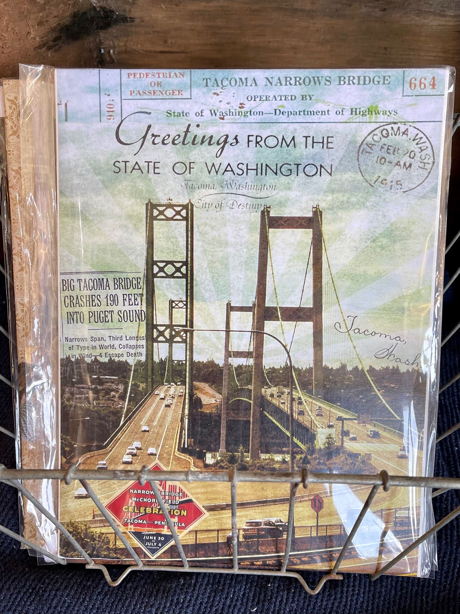
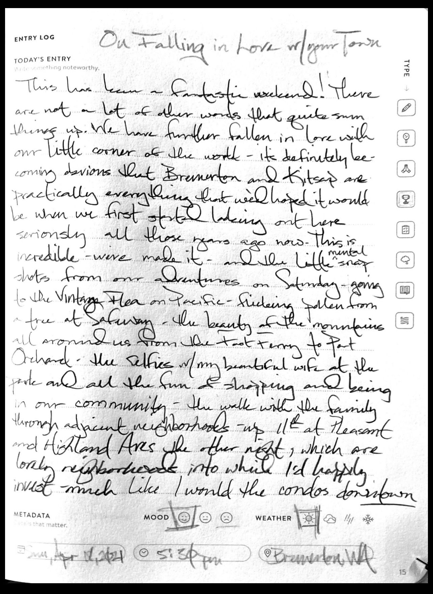

There is something magical about actually falling in love with where you live.

Loving Where You Live
---------------------

A shot of a journal page about this very topic!

### Necessary backstory... ???

I have been trying to move to the Pacific Northwest for a very long time. So has Manda. Since we both discovering our mutual love of the PNW, we have been talking more and more about making our dreams a reality, with it always feeling just out of reach for some reason or another since forever.

We've taken trips out to the Seattle area for years: planning, scoping, dreaming, and hoping. After spending a couple weeks house sitting Kingston, WA some years ago, the viability of Kitsap County became obvious. We had been talking about trying to find a way to land in the Seattle region, but Kitsap has a lot of advantages that appeal to us.

Example benefits:

#### Less Expensive

Housing on this side of the sound is substantially less expensive, sales and property taxes are lower, and things, in general, just cost a bit less in Kitsap. I've discovered that there are a lot of different opinions about a lot of topics around here and one is _why_ it's cheaper here. I've spoken with a few folks about it and they have a lot of ideas. It's obviously cheaper than Seattle but also prices are lower here than just down in Tacoma yet has very near the same amenities. Whatever the reasons, it's advantageous and certainly allows us to make ends meet.

#### Feels Small Town

Kitsap County's population is in the range of a quarter of million people and they're generally more spread out throughout the area than of nearby more populous (and enormous) King and Pierce Counties. There's a small tight urban center in Bremerton and a across in Port Orchard. Silverdale, the region's retail center, has a more suburban population. Poulsbo feels like semi-urban suburbia, similarly Bainbridge has its own vibe of mixed suburban-rural, and all of it edged right up to very rural and natural lands.

#### Quick access to major population centers

We strongly considered buying in Tacoma for its lower (compared to Seattle) cost of living and general vibe. Their motto of "Keep Tacoma Feared" was appealing to us. We actually spent more than a month living there while we were house hunting and working on landing our first home here.

In the end, many advantages seemed to become clear in favor of Bremerton. For example: we can reach Seattle, Tacoma, and Olympia all very quickly.

Seattle can be accessed via some varying levels of convenient Ferry travel, the [WSF](https://wsdot.wa.gov/ferries) can get us (and our vehicle) across in about an hour while the [Kitsap County Fast Ferry](https://www.kitsaptransit.com/service/fast-ferry/bremerton-fast-ferry) can do it in about 30 minutes. Tacoma (Downtown or Mall), on the other hand, can be reached in about 35 minutes via the Tacoma Narrows Bridge. Finally, there's roughly and hour drive to get to Olympia, and a couple paths to take including the only way off the peninsula.

That's not the end of it, either. There are other ferries, the hood canal bridge, and even (when the ferry is running and the border is open) a pretty quick way to Vancouver Island in Canada.

### Living is Believing

Greetings from the State of Washington

We have been considering this move for a long time, though interestingly hadn't physically set foot in Bremerton before we made the move the Washington last year. We had spent a good amount of time in Kitsap, as well as learning about Kitsap from afar (reading the news, lurking in the online communities, chatting with locals, etc.). I felt I knew the streets pretty well after years of flying around this town on Google Maps and Street View.

Now that we've been here for a little while, I can say with certainty that it's exactly what we'd been hoping for, and then some.

We wanted the small town vibe, big town access, urban-meets-PNW-nature, and we got it!

We are truly falling in love with this town and it's absolutely fantastic.

### ...and we got a mountain view!

From our porch and living room we are able to see the Olympics though a small gap between a neighbor's house and their garage just up the street. Of course from all over this town you can see mountains, from the Cascades in the East to the nearby Olympics just to the West, and of course Mt. Rainier to the south east.

Mt. Rainier

The Olympics

And we're nearer the beautiful coast, though nothing like Southern California, there is [evidence](https://breakerslongbeach.com/) of some [really amazing](https://www.tokelandhotel.com/) places [to escape](https://pebblecovefarm.com/) to from society, along with some beautiful [escapes](https://www.nps.gov/olym/planyourvisit/visiting-the-hoh.htm) into the Olympics as well.

And really all over this region.

These are reasons why we moved here.

Back to the point...
--------------------

The point is that recently Manda and I have been really falling in love with our new town. We've been walking around, discovering the various neighboring communities to our own.

We've recently discovered the incredible flexibility of [Port Orchard Foot Ferry](https://www.kitsaptransit.com/service/foot-ferry) which gets us from our front door into the lovely shopping area of Port Orchard in about 12 minutes (after a comfortable little walk to the ferry terminal) in a better than city bus level of comfort. Running every 30 minutes in both directions the ferry is, to say the least, a wonderful connection to our neighboring city and county seat.

#### An Aside About Port Orchard

Before we bought our house we looked at a place in Port Orchard on a hill well above the adorable downtown. Had I not been terrified that the house would inevitably have slid down in a catastrophic way we may have wound up there. Every creak would have terrified me, no matter how nice the place was otherwise, and it was pretty nice.

Much of Port Orchard's business selection is fantastic. Their retail and fast food selection is similar to what you can find in Silverdale. Because of how things are laid out - it's about a wash to drive up to Silverdale from Bremerton compared to into the same store, should it exist, in Port Orchard.

Amazing Shopping Awaits

The ferry makes the historic Port Orchard downtown. (If only I could get to Poulsbo, or better: Bainbridge through the same ferry system) as well as a library and little boardwalk and park.

Oh, and Port Orchard definitely has some stunning views, often superior to the views on the Bremerton side in comparison. (@TODO this feels like another post...)

I could go on, but the bottom line is that goes a long way to my ultimate goal of living as close as possible to a walkable lifestyle.

### Speaking of Walkable

I remember being a little surprised when my Realtor, who was fantastic by the way, told us that people generally aren't looking for walkable around this area, and that's so surprising to me.

I'm finding that there's so much opportunity around this area, especially where I am. Nearby I can count the wonderful little shops, restaurants, kitchens, and more that are all accessible through a short walk (and the occasional car ride when you're just tryna pick up some [dinner for the fam](https://www.theshop2712.com/) ( update: this place has closed :( )

#### and we love walking here

One of Bremerton's strange charms is all the cats. I am no stranger to feral cat communities. We've even cared for a few feral cats in our time together. The feral cat communities here are very present. To the point that I think I could easily film a low budget horror film just from walking around this town with my iPhone on a gimbal.

Cats 'round here are intense AF

(maybe I will)
