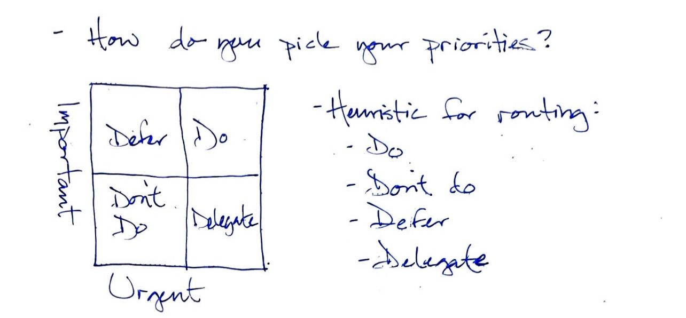

It's interesting to me to think about my job as “Engineering Manager” and the words “Engineering” and “Management”.

Then I think about what might it mean to engineer management?

We do that through process.

Through trial and error.

Through iterative adaptation.

Today I spoke with a fellow traveler on this journey of life, a person whom I greatly respect and admire that is good enough to give me their precious time and drops knowledge every time speak. They're also one of a shocking number of colleagues with whom I'm connected that goes by the moniker: JLo.

I was talking with JLo about feeling overwhelmed with my current inability to prioritize the many different requests, responsibilities, and opportunities I find before me.

He offered his mental heuristic, which I chicken scratched out here:

Important v. Urgent

This concept is not new to me, but of late I've found myself feeling stressed and overwhelmed both personally and professionally, which has got me thinking and reflecting on what I am currently facing both at work and at home. I have realized that I don't even have a real list of everything in my head, and certainly not everything is written down.

It's challenging to consider what's  most important based on this model when I'm not entirely sure everything I'm even facing at any given time.

I've started considering how to get organized (again). First step will be a brain dump. I will try to simply all the things in my head out: goals, todos, tasks, ideas, plans. Next I will attempt to index across the various work input streams such as my team's service desk queue, backlog, and various support channels.

Finally, I'll need to break down how I would even categorize each aspect of this list based on urgency and importance. I know this will be a challenge for me in particular because I also tend to think of things based on complexity as well as try to consider their value as it relates to myself, my team, my org, and the world.

As I think about these things I expect that I'm going to find that there is a lot of items that are unimportant and non-urgent, which means they can be deleted or ignored. This may require having the _courage_ to say **no** to some stake holders, however.

Next I'm certain that I will discover a similarly prevalent batch of tasks that are important but not (yet) urgent. Those items are deferrable, and can be added to, or left in, the backlog.

I expect to find that there are a few items that are urgent but not entirely important. These, per our model, should be delegated - and this is an area where I certainly struggle and will need to reflect the most.

My final expectation is that I'll discover that the smallest list, and one I expect I should already know intimately, will be items that are both important and urgent. This is where the model above says I should focus my execution.

It seems simple when written out and reflected upon, but in practice that's not always the case.

Studies are clear that stress, such as the stress that results from feeling overwhelmed by having more work to do than time which to complete said work, can actually impair your cognition and reasoning.

Literally: when you're in reactive mode, you're often stuck in reactive mode at least until you find a way to constrain your work in progress so that you can process, evaluate, and re-engage.

I'm tired of feeling frustrated and plan to engineer control of my work again.

Failing that, I will need to re-consider what is truly important and perhaps try another route on my journey.
