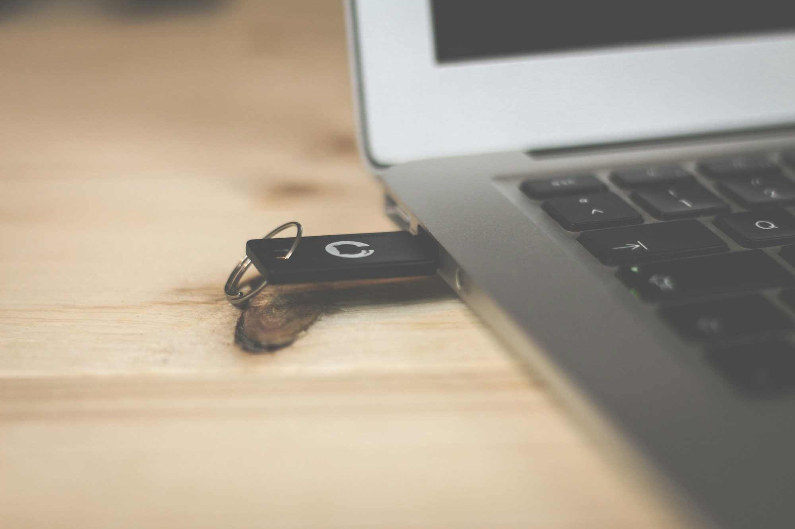

I'm tired of forgetting these steps, so they're here for me for later but I hope they help you too.

TL;DR
-----

sudo dd if=distro.iso of=/dev/sda status="progress"

L;R
---

You'll need two things to accomplish this process

To make a bootable USB drive, you need a USB flash drive that is larger than the disc image you're trying to write and a bootable disc image in ISO format.

Whatever the size of your USB flash drive, it will be constrained to the the size of the image you're creating, additional space will no longer be accessible.

First, insert your drive.

Make sure the drive is seen by your OS, and find out if it's mounted or not using any number of programs like LSBLK or FDISK. Your drive should appear like `/dev/sda` or `/dev/sdb`, and you might see a numbered partition as well like `/dev/sda1` for example.

Make sure that the drive is not mounted (unmounted):

umount /dev/sda

Where `/dev/sda` is the path or your drive.

Next you'll want to format the drive. **THIS WILL ERASE THE DRIVE!!!**

sudo mkfs.ext4 /dev/sda1

This should be straightforward and simple, you'll see some status related to the progress and then you'll have a fresh drive.

Finally, make sure you're in the directory where your downloaded ISO file lives and then write it to the flash with DD. For example: if you're creating a bootable Puppy Linux install disk and your ISO file is `puppy-linux.iso` and your USB is attached at `/dev/sda` your command would look like this:

sudo dd if=puppy-linux.iso of=/dev/sda status=progress

The `if` parameter is 'input file' while `of` is, unsurprisingly, 'output file'

The `status` parameter being set to progress gives you regular feedback while the process is running, which is particularly useful for very large image writes that could take a little time and feel like your machine has hung or something.

And that's it.

Seriously, it's really easy, I just sometimes forget a step or two.

Arguably it's easier than [Rufus](https://rufus.ie/) or [Balena Etcher](https://www.balena.io/etcher/), which you'd probably want to use if you're on macOS or Windows (or even Linux, which is an option for Balena Etcher, if you're so inclined)
