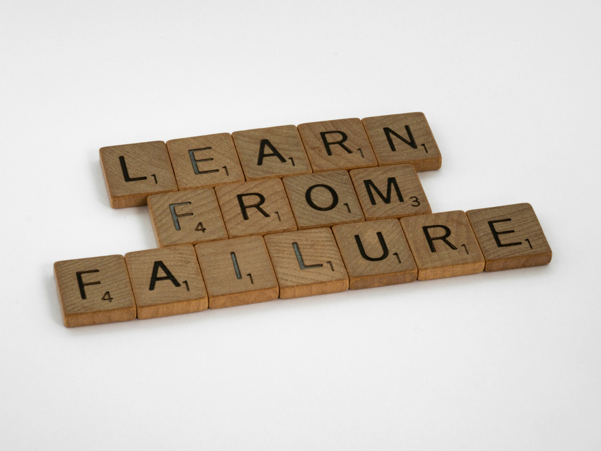

Mistakes are how we learn. From the time that we're young, we make mistakes as we try to understand and interact with the world around us. Making mistakes is a vital part of our growth and forms the foundation for our successes. Mistakes help us to discover our limits, explore our capabilities, and push and challenge us to do better.

Mistakes allow us to develop our skills and problem-solving abilities, and even cause us to think outside of the box to find creative solutions.

It's critical to learn from mistakes, and when you learn to lean into the fact that you _will_ make mistakes, then you can be prepared.

For example: imagine you're running a migration to add a column to a model. This is no big deal, right? This shouldn't be a big issue in most cases, right? Let's say this model is for a “template part”, it's polymorphic. Adding the new column shouldn't having any impact on your API.

But let's be honest: just because something shouldn't cause an issue doesn't mean it won't.

Something like this happened recently. I was lucky enough to have a team able to help me out while I'm still learning my way into a relatively complex project.

In our circumstance I missed something that, in hindsight anyway, seems pretty obvious, but now a change to a property was causing issues with the UI. In my case it wasn't just an additive change to the schema, but it could have been. This shouldn't have happened, if we were doing everything right, but we weren't and how could we?

It might sound corny, though, the entire thing has helped me to learn a variety of new things about how this application works, and how the UI is designed. It's given me insight that I didn't have, and I choose to embrace the “what's in it for me” aspect of an otherwise unfortunate situation.

I find it has been helpful to build the muscle around my intuition. Sometimes it helps to plan to fail. More than just knowing how to revert your changes or re-run a last known good pipeline, I'm talking about thinking through everything that could go wrong with your changes and walking it backwards. Deeply consider your changes, make a plan to undo what you've done, be ready for failure.

The best part is that when it fails in some completely unexpected way, you get to quickly learn about something you didn't know. The more mistakes you make, the more you've are exposed to things you didn't know, the more learning opportunities you create for yourself and learn from in the long run.

Honestly, I think I could make a better point, or any point, but I think I've sort of lost the thread of this post.

I started with “The Value of Making Mistakes,” right?

The value of making mistakes is that it allows us to push our boundaries and learn from them, leading to deeper understanding of our capabilities and discovering our limits. Mistakes give us a sense of growth and development, as well as the opportunity to develop our problem-solving skills and think outside the box. Ultimately, learning from our mistakes, can lead us to greater success in all aspects of life.
