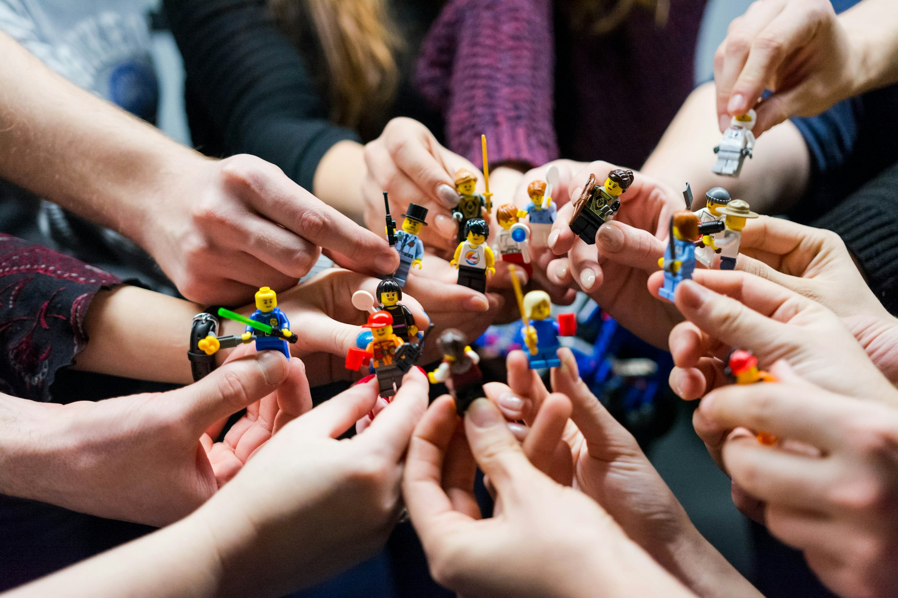

I have wanted for awhile to re-visit the topic of Psychological Safety after my [previous post](/blog/psychological-safety-by-chatgpt/) on the topic to create a slightly more succinct an thoughtful post. Here it is:

In the corporate world, the pursuit of high-performing teams is a top priority. Many businesses focus on acquiring top talent or creating the perfect blend of complementary skills within a team. While these are important aspects, they are not the only factors that drive a team's success. A key element that often gets overlooked is the concept of psychological safety.

Psychological safety, as defined by Harvard Business School professor [Amy C. Edmondson](https://amycedmondson.com/psychological-safety/), is "a shared belief by members of a team that the team is safe for interpersonal risk-taking." This means team members feel comfortable voicing their opinions, taking moderate risks, and making mistakes without fear of judgment or negative repercussions. They feel accepted and respected, which contributes to a positive team dynamic and facilitates the sharing of ideas and knowledge.

This concept of psychological safety was further supported by [Google's Project Aristotle](https://rework.withgoogle.com/print/guides/5721312655835136/). This project, which began in 2012, studied hundreds of Google's teams to identify what makes a team effective. Surprisingly, the research showed that who is in the team mattered less than how the team members interacted and made contributions. One of the key dynamics of high-performing teams identified was psychological safety - the ability of team members to take risks without feeling insecure or embarrassed.

Creating a psychologically safe environment involves a few crucial steps. Firstly, experimentation should be encouraged. This allows for the growth of innovative thinking and promotes a culture of learning. Secondly, it's essential to make it clear that mistakes are part of the learning process. Instead of rushing to find a solution when a mistake is made, take the time to explore why the mistake was made as a team. This can help the team evolve and avoid making the same mistakes in the future.

Additionally, as a leader, it's crucial to ask questions and demonstrate vulnerability. This not only shows that you don't know everything, but it also sends a message that the workplace is a safe environment where employees can be vulnerable and learn. Finally, openly sharing knowledge can help your teams learn, innovate, and grow within a psychologically safe space.

Psychological safety not only contributes to a positive and inclusive culture, but it also leads to better performance, higher employee engagement, and lower turnover rates. By focusing on fostering psychological safety, businesses can cultivate high-performing teams and realize their full potential.

Remember, the strength of a team lies not just in the collective skills of its members, but also in the quality of their interactions and the safety they feel when taking risks together.

Creating a psychologically safe environment might take time, but the benefits it brings in terms of team performance and employee satisfaction make it well worth the effort.
