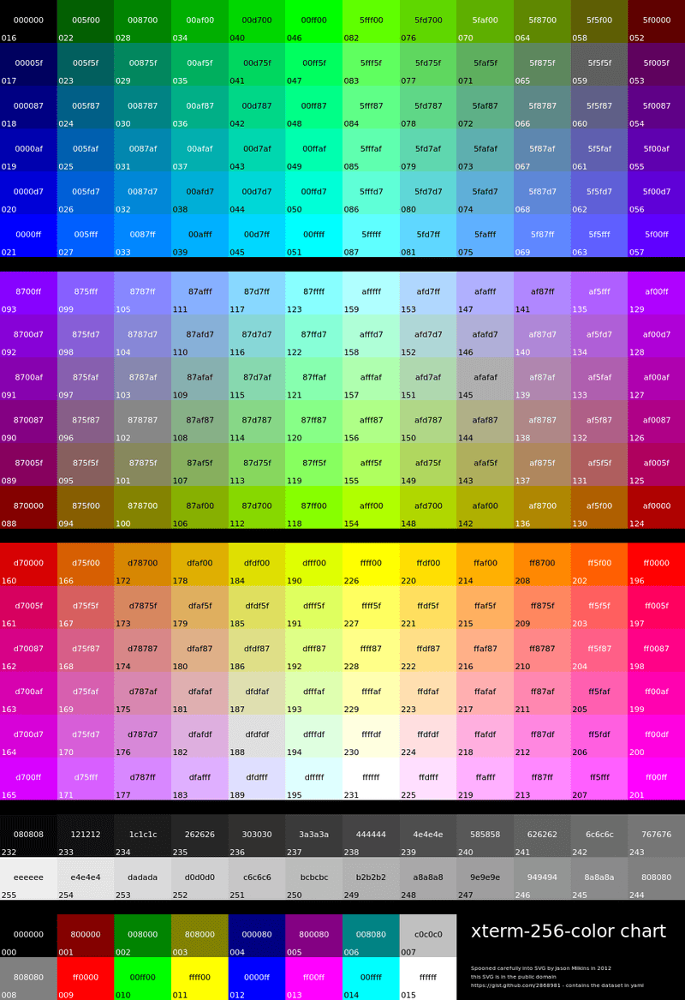

Every so often I decide I want to make some changes to my terminal or add colors to a script and then I have to go looking up a list of color codes.

Data available [here](https://gist.github.com/jasonm23/2868981).

To save future me some time, and perhaps present you, here are some tables with some codes that might help:

<table class="table hexcolors" style="width: auto; margin-left: auto; margin-right: auto;">
    <caption>
        16 Color Palette
    </caption>
    <tbody>
        <tr>
            <td class="lightfont" style="background-color: #000000;">
                
                    000
                
                 
                
                    #000000
                
            </td>
            <td class="lightfont" style="background-color: #800000;">
                
                    001
                
                 
                
                    #800000
                
            </td>
            <td class="lightfont" style="background-color: #008000;">
                
                    002
                
                 
                
                    #008000
                
            </td>
            <td class="lightfont" style="background-color: #808000;">
                
                    003
                
                 
                
                    #808000
                
            </td>
            <td class="lightfont" style="background-color: #000080;">
                
                    004
                
                 
                
                    #000080
                
            </td>
            <td class="lightfont" style="background-color: #800080;">
                
                    005
                
                 
                
                    #800080
                
            </td>
            <td class="lightfont" style="background-color: #008080;">
                
                    006
                
                 
                
                    #008080
                
            </td>
            <td class="darkfont" style="background-color: #c0c0c0;">
                
                    007
                
                 
                
                    #c0c0c0
                
            </td>
        </tr>
        <tr>
            <td class="lightfont" style="background-color: #808080;">
                
                    008
                
                 
                
                    #808080
                
            </td>
            <td class="lightfont" style="background-color: #ff0000;">
                
                    009
                
                 
                
                    #ff0000
                
            </td>
            <td class="darkfont" style="background-color: #00ff00;">
                
                    010
                
                 
                
                    #00ff00
                
            </td>
            <td class="darkfont" style="background-color: #ffff00;">
                
                    011
                
                 
                
                    #ffff00
                
            </td>
            <td class="lightfont" style="background-color: #0000ff;">
                
                    012
                
                 
                
                    #0000ff
                
            </td>
            <td class="lightfont" style="background-color: #ff00ff;">
                
                    013
                
                 
                
                    #ff00ff
                
            </td>
            <td class="darkfont" style="background-color: #00ffff;">
                
                    014
                
                 
                
                    #00ffff
                
            </td>
            <td class="darkfont" style="background-color: #ffffff;">
                
                    015
                
                 
                
                    #ffffff
                
            </td>
        </tr>
    </tbody>
</table>

<table class="table hexcolors" style="width: auto; margin-left: auto; margin-right: auto;">
    <caption>
        24 Greyscale Palette
    </caption>
    <tbody>
        <tr>
            <td class="lightfont" style="background-color: #080808;">
                
                    232
                
                 
                
                    #080808
                
            </td>
            <td class="lightfont" style="background-color: #121212;">
                
                    233
                
                 
                
                    #121212
                
            </td>
            <td class="lightfont" style="background-color: #1c1c1c;">
                
                    234
                
                 
                
                    #1c1c1c
                
            </td>
            <td class="lightfont" style="background-color: #262626;">
                
                    235
                
                 
                
                    #262626
                
            </td>
            <td class="lightfont" style="background-color: #303030;">
                
                    236
                
                 
                
                    #303030
                
            </td>
            <td class="lightfont" style="background-color: #3a3a3a;">
                
                    237
                
                 
                
                    #3a3a3a
                
            </td>
            <td class="lightfont" style="background-color: #444444;">
                
                    238
                
                 
                
                    #444444
                
            </td>
            <td class="lightfont" style="background-color: #4e4e4e;">
                
                    239
                
                 
                
                    #4e4e4e
                
            </td>
            <td class="lightfont" style="background-color: #585858;">
                
                    240
                
                 
                
                    #585858
                
            </td>
            <td class="lightfont" style="background-color: #626262;">
                
                    241
                
                 
                
                    #626262
                
            </td>
            <td class="lightfont" style="background-color: #6c6c6c;">
                
                    242
                
                 
                
                    #6c6c6c
                
            </td>
            <td class="lightfont" style="background-color: #767676;">
                
                    243
                
                 
                
                    #767676
                
            </td>
        </tr>
        <tr>
            <td class="darkfont" style="background-color: #eeeeee;">
                
                    255
                
                 
                
                    #eeeeee
                
            </td>
            <td class="darkfont" style="background-color: #e4e4e4;">
                
                    254
                
                 
                
                    #e4e4e4
                
            </td>
            <td class="darkfont" style="background-color: #dadada;">
                
                    253
                
                 
                
                    #dadada
                
            </td>
            <td class="darkfont" style="background-color: #d0d0d0;">
                
                    252
                
                 
                
                    #d0d0d0
                
            </td>
            <td class="darkfont" style="background-color: #c6c6c6;">
                
                    251
                
                 
                
                    #c6c6c6
                
            </td>
            <td class="darkfont" style="background-color: #bcbcbc;">
                
                    250
                
                 
                
                    #bcbcbc
                
            </td>
            <td class="darkfont" style="background-color: #b2b2b2;">
                
                    249
                
                 
                
                    #b2b2b2
                
            </td>
            <td class="darkfont" style="background-color: #a8a8a8;">
                
                    248
                
                 
                
                    #a8a8a8
                
            </td>
            <td class="darkfont" style="background-color: #9e9e9e;">
                
                    247
                
                 
                
                    #9e9e9e
                
            </td>
            <td class="darkfont" style="background-color: #949494;">
                
                    246
                
                 
                
                    #949494
                
            </td>
            <td class="lightfont" style="background-color: #8a8a8a;">
                
                    245
                
                 
                
                    #8a8a8a
                
            </td>
            <td class="lightfont" style="background-color: #808080;">
                
                    244
                
                 
                
                    #808080
                
            </td>
        </tr>
    </tbody>
</table>

<table class="table hexcolors" style="width: auto; margin-left: auto; margin-right: auto;">
    <caption>
        256 Colors Palette
    </caption>
    <tbody>
        <tr>
            <td class="lightfont" style="background-color: #000000;">
                
                    016
                
                 
                
                    #000000
                
            </td>
            <td class="lightfont" style="background-color: #005f00;">
                
                    022
                
                 
                
                    #005f00
                
            </td>
            <td class="lightfont" style="background-color: #008700;">
                
                    028
                
                 
                
                    #008700
                
            </td>
            <td class="lightfont" style="background-color: #00af00;">
                
                    034
                
                 
                
                    #00af00
                
            </td>
            <td class="lightfont" style="background-color: #00d700;">
                
                    040
                
                 
                
                    #00d700
                
            </td>
            <td class="darkfont" style="background-color: #00ff00;">
                
                    046
                
                 
                
                    #00ff00
                
            </td>
            <td class="darkfont" style="background-color: #5fff00;">
                
                    082
                
                 
                
                    #5fff00
                
            </td>
            <td class="darkfont" style="background-color: #5fd700;">
                
                    076
                
                 
                
                    #5fd700
                
            </td>
            <td class="lightfont" style="background-color: #5faf00;">
                
                    070
                
                 
                
                    #5faf00
                
            </td>
            <td class="lightfont" style="background-color: #5f8700;">
                
                    064
                
                 
                
                    #5f8700
                
            </td>
            <td class="lightfont" style="background-color: #5f5f00;">
                
                    058
                
                 
                
                    #5f5f00
                
            </td>
            <td class="lightfont" style="background-color: #5f0000;">
                
                    052
                
                 
                
                    #5f0000
                
            </td>
        </tr>
        <tr>
            <td class="lightfont" style="background-color: #00005f;">
                
                    017
                
                 
                
                    #00005f
                
            </td>
            <td class="lightfont" style="background-color: #005f5f;">
                
                    023
                
                 
                
                    #005f5f
                
            </td>
            <td class="lightfont" style="background-color: #00875f;">
                
                    029
                
                 
                
                    #00875f
                
            </td>
            <td class="lightfont" style="background-color: #00af5f;">
                
                    035
                
                 
                
                    #00af5f
                
            </td>
            <td class="lightfont" style="background-color: #00d75f;">
                
                    041
                
                 
                
                    #00d75f
                
            </td>
            <td class="darkfont" style="background-color: #00ff5f;">
                
                    047
                
                 
                
                    #00ff5f
                
            </td>
            <td class="darkfont" style="background-color: #5fff5f;">
                
                    083
                
                 
                
                    #5fff5f
                
            </td>
            <td class="darkfont" style="background-color: #5fd75f;">
                
                    077
                
                 
                
                    #5fd75f
                
            </td>
            <td class="lightfont" style="background-color: #5faf5f;">
                
                    071
                
                 
                
                    #5faf5f
                
            </td>
            <td class="lightfont" style="background-color: #5f875f;">
                
                    065
                
                 
                
                    #5f875f
                
            </td>
            <td class="lightfont" style="background-color: #5f5f5f;">
                
                    059
                
                 
                
                    #5f5f5f
                
            </td>
            <td class="lightfont" style="background-color: #5f005f;">
                
                    053
                
                 
                
                    #5f005f
                
            </td>
        </tr>
        <tr>
            <td class="lightfont" style="background-color: #000087;">
                
                    018
                
                 
                
                    #000087
                
            </td>
            <td class="lightfont" style="background-color: #005f87;">
                
                    024
                
                 
                
                    #005f87
                
            </td>
            <td class="lightfont" style="background-color: #008787;">
                
                    030
                
                 
                
                    #008787
                
            </td>
            <td class="lightfont" style="background-color: #00af87;">
                
                    036
                
                 
                
                    #00af87
                
            </td>
            <td class="lightfont" style="background-color: #00d787;">
                
                    042
                
                 
                
                    #00d787
                
            </td>
            <td class="darkfont" style="background-color: #00ff87;">
                
                    048
                
                 
                
                    #00ff87
                
            </td>
            <td class="darkfont" style="background-color: #5fff87;">
                
                    084
                
                 
                
                    #5fff87
                
            </td>
            <td class="darkfont" style="background-color: #5fd787;">
                
                    078
                
                 
                
                    #5fd787
                
            </td>
            <td class="darkfont" style="background-color: #5faf87;">
                
                    072
                
                 
                
                    #5faf87
                
            </td>
            <td class="lightfont" style="background-color: #5f8787;">
                
                    066
                
                 
                
                    #5f8787
                
            </td>
            <td class="lightfont" style="background-color: #5f5f87;">
                
                    060
                
                 
                
                    #5f5f87
                
            </td>
            <td class="lightfont" style="background-color: #5f0087;">
                
                    054
                
                 
                
                    #5f0087
                
            </td>
        </tr>
        <tr>
            <td class="lightfont" style="background-color: #0000af;">
                
                    019
                
                 
                
                    #0000af
                
            </td>
            <td class="lightfont" style="background-color: #005faf;">
                
                    025
                
                 
                
                    #005faf
                
            </td>
            <td class="lightfont" style="background-color: #0087af;">
                
                    031
                
                 
                
                    #0087af
                
            </td>
            <td class="lightfont" style="background-color: #00afaf;">
                
                    037
                
                 
                
                    #00afaf
                
            </td>
            <td class="darkfont" style="background-color: #00d7af;">
                
                    043
                
                 
                
                    #00d7af
                
            </td>
            <td class="darkfont" style="background-color: #00ffaf;">
                
                    049
                
                 
                
                    #00ffaf
                
            </td>
            <td class="darkfont" style="background-color: #5fffaf;">
                
                    085
                
                 
                
                    #5fffaf
                
            </td>
            <td class="darkfont" style="background-color: #5fd7af;">
                
                    079
                
                 
                
                    #5fd7af
                
            </td>
            <td class="darkfont" style="background-color: #5fafaf;">
                
                    073
                
                 
                
                    #5fafaf
                
            </td>
            <td class="lightfont" style="background-color: #5f87af;">
                
                    067
                
                 
                
                    #5f87af
                
            </td>
            <td class="lightfont" style="background-color: #5f5faf;">
                
                    061
                
                 
                
                    #5f5faf
                
            </td>
            <td class="lightfont" style="background-color: #5f00af;">
                
                    055
                
                 
                
                    #5f00af
                
            </td>
        </tr>
        <tr>
            <td class="lightfont" style="background-color: #0000d7;">
                
                    020
                
                 
                
                    #0000d7
                
            </td>
            <td class="lightfont" style="background-color: #005fd7;">
                
                    026
                
                 
                
                    #005fd7
                
            </td>
            <td class="lightfont" style="background-color: #0087d7;">
                
                    032
                
                 
                
                    #0087d7
                
            </td>
            <td class="lightfont" style="background-color: #00afd7;">
                
                    038
                
                 
                
                    #00afd7
                
            </td>
            <td class="darkfont" style="background-color: #00d7d7;">
                
                    044
                
                 
                
                    #00d7d7
                
            </td>
            <td class="darkfont" style="background-color: #00ffd7;">
                
                    050
                
                 
                
                    #00ffd7
                
            </td>
            <td class="darkfont" style="background-color: #5fffd7;">
                
                    086
                
                 
                
                    #5fffd7
                
            </td>
            <td class="darkfont" style="background-color: #5fd7d7;">
                
                    080
                
                 
                
                    #5fd7d7
                
            </td>
            <td class="darkfont" style="background-color: #5fafd7;">
                
                    074
                
                 
                
                    #5fafd7
                
            </td>
            <td class="lightfont" style="background-color: #5f87d7;">
                
                    068
                
                 
                
                    #5f87d7
                
            </td>
            <td class="lightfont" style="background-color: #5f5fd7;">
                
                    062
                
                 
                
                    #5f5fd7
                
            </td>
            <td class="lightfont" style="background-color: #5f00d7;">
                
                    056
                
                 
                
                    #5f00d7
                
            </td>
        </tr>
        <tr>
            <td class="lightfont" style="background-color: #0000ff;">
                
                    021
                
                 
                
                    #0000ff
                
            </td>
            <td class="lightfont" style="background-color: #005fff;">
                
                    027
                
                 
                
                    #005fff
                
            </td>
            <td class="lightfont" style="background-color: #0087ff;">
                
                    033
                
                 
                
                    #0087ff
                
            </td>
            <td class="lightfont" style="background-color: #00afff;">
                
                    039
                
                 
                
                    #00afff
                
            </td>
            <td class="darkfont" style="background-color: #00d7ff;">
                
                    045
                
                 
                
                    #00d7ff
                
            </td>
            <td class="darkfont" style="background-color: #00ffff;">
                
                    051
                
                 
                
                    #00ffff
                
            </td>
            <td class="darkfont" style="background-color: #5fffff;">
                
                    087
                
                 
                
                    #5fffff
                
            </td>
            <td class="darkfont" style="background-color: #5fd7ff;">
                
                    081
                
                 
                
                    #5fd7ff
                
            </td>
            <td class="darkfont" style="background-color: #5fafff;">
                
                    075
                
                 
                
                    #5fafff
                
            </td>
            <td class="lightfont" style="background-color: #5f87ff;">
                
                    069
                
                 
                
                    #5f87ff
                
            </td>
            <td class="lightfont" style="background-color: #5f5fff;">
                
                    063
                
                 
                
                    #5f5fff
                
            </td>
            <td class="lightfont" style="background-color: #5f00ff;">
                
                    057
                
                 
                
                    #5f00ff
                
            </td>
        </tr>
        <tr>
            <td class="lightfont" style="background-color: #8700ff;">
                
                    093
                
                 
                
                    #8700ff
                
            </td>
            <td class="lightfont" style="background-color: #875fff;">
                
                    099
                
                 
                
                    #875fff
                
            </td>
            <td class="darkfont" style="background-color: #8787ff;">
                
                    105
                
                 
                
                    #8787ff
                
            </td>
            <td class="darkfont" style="background-color: #87afff;">
                
                    111
                
                 
                
                    #87afff
                
            </td>
            <td class="darkfont" style="background-color: #87d7ff;">
                
                    117
                
                 
                
                    #87d7ff
                
            </td>
            <td class="darkfont" style="background-color: #87ffff;">
                
                    123
                
                 
                
                    #87ffff
                
            </td>
            <td class="darkfont" style="background-color: #afffff;">
                
                    159
                
                 
                
                    #afffff
                
            </td>
            <td class="darkfont" style="background-color: #afd7ff;">
                
                    153
                
                 
                
                    #afd7ff
                
            </td>
            <td class="darkfont" style="background-color: #afafff;">
                
                    147
                
                 
                
                    #afafff
                
            </td>
            <td class="darkfont" style="background-color: #af87ff;">
                
                    141
                
                 
                
                    #af87ff
                
            </td>
            <td class="lightfont" style="background-color: #af5fff;">
                
                    135
                
                 
                
                    #af5fff
                
            </td>
            <td class="lightfont" style="background-color: #af00ff;">
                
                    129
                
                 
                
                    #af00ff
                
            </td>
        </tr>
        <tr>
            <td class="lightfont" style="background-color: #8700d7;">
                
                    092
                
                 
                
                    #8700d7
                
            </td>
            <td class="lightfont" style="background-color: #875fd7;">
                
                    098
                
                 
                
                    #875fd7
                
            </td>
            <td class="lightfont" style="background-color: #8787d7;">
                
                    104
                
                 
                
                    #8787d7
                
            </td>
            <td class="darkfont" style="background-color: #87afd7;">
                
                    110
                
                 
                
                    #87afd7
                
            </td>
            <td class="darkfont" style="background-color: #87d7d7;">
                
                    116
                
                 
                
                    #87d7d7
                
            </td>
            <td class="darkfont" style="background-color: #87ffd7;">
                
                    122
                
                 
                
                    #87ffd7
                
            </td>
            <td class="darkfont" style="background-color: #afffd7;">
                
                    158
                
                 
                
                    #afffd7
                
            </td>
            <td class="darkfont" style="background-color: #afd7d7;">
                
                    152
                
                 
                
                    #afd7d7
                
            </td>
            <td class="darkfont" style="background-color: #afafd7;">
                
                    146
                
                 
                
                    #afafd7
                
            </td>
            <td class="darkfont" style="background-color: #af87d7;">
                
                    140
                
                 
                
                    #af87d7
                
            </td>
            <td class="lightfont" style="background-color: #af5fd7;">
                
                    134
                
                 
                
                    #af5fd7
                
            </td>
            <td class="lightfont" style="background-color: #af00d7;">
                
                    128
                
                 
                
                    #af00d7
                
            </td>
        </tr>
        <tr>
            <td class="lightfont" style="background-color: #8700af;">
                
                    091
                
                 
                
                    #8700af
                
            </td>
            <td class="lightfont" style="background-color: #875faf;">
                
                    097
                
                 
                
                    #875faf
                
            </td>
            <td class="lightfont" style="background-color: #8787af;">
                
                    103
                
                 
                
                    #8787af
                
            </td>
            <td class="darkfont" style="background-color: #87afaf;">
                
                    109
                
                 
                
                    #87afaf
                
            </td>
            <td class="darkfont" style="background-color: #87d7af;">
                
                    115
                
                 
                
                    #87d7af
                
            </td>
            <td class="darkfont" style="background-color: #87ffaf;">
                
                    121
                
                 
                
                    #87ffaf
                
            </td>
            <td class="darkfont" style="background-color: #afffaf;">
                
                    157
                
                 
                
                    #afffaf
                
            </td>
            <td class="darkfont" style="background-color: #afd7af;">
                
                    151
                
                 
                
                    #afd7af
                
            </td>
            <td class="darkfont" style="background-color: #afafaf;">
                
                    145
                
                 
                
                    #afafaf
                
            </td>
            <td class="darkfont" style="background-color: #af87af;">
                
                    139
                
                 
                
                    #af87af
                
            </td>
            <td class="lightfont" style="background-color: #af5faf;">
                
                    133
                
                 
                
                    #af5faf
                
            </td>
            <td class="lightfont" style="background-color: #af00af;">
                
                    127
                
                 
                
                    #af00af
                
            </td>
        </tr>
        <tr>
            <td class="lightfont" style="background-color: #870087;">
                
                    090
                
                 
                
                    #870087
                
            </td>
            <td class="lightfont" style="background-color: #875f87;">
                
                    096
                
                 
                
                    #875f87
                
            </td>
            <td class="lightfont" style="background-color: #878787;">
                
                    102
                
                 
                
                    #878787
                
            </td>
            <td class="darkfont" style="background-color: #87af87;">
                
                    108
                
                 
                
                    #87af87
                
            </td>
            <td class="darkfont" style="background-color: #87d787;">
                
                    114
                
                 
                
                    #87d787
                
            </td>
            <td class="darkfont" style="background-color: #87ff87;">
                
                    120
                
                 
                
                    #87ff87
                
            </td>
            <td class="darkfont" style="background-color: #afff87;">
                
                    156
                
                 
                
                    #afff87
                
            </td>
            <td class="darkfont" style="background-color: #afd787;">
                
                    150
                
                 
                
                    #afd787
                
            </td>
            <td class="darkfont" style="background-color: #afaf87;">
                
                    144
                
                 
                
                    #afaf87
                
            </td>
            <td class="darkfont" style="background-color: #af8787;">
                
                    138
                
                 
                
                    #af8787
                
            </td>
            <td class="lightfont" style="background-color: #af5f87;">
                
                    132
                
                 
                
                    #af5f87
                
            </td>
            <td class="lightfont" style="background-color: #af0087;">
                
                    126
                
                 
                
                    #af0087
                
            </td>
        </tr>
        <tr>
            <td class="lightfont" style="background-color: #87005f;">
                
                    089
                
                 
                
                    #87005f
                
            </td>
            <td class="lightfont" style="background-color: #875f5f;">
                
                    095
                
                 
                
                    #875f5f
                
            </td>
            <td class="lightfont" style="background-color: #87875f;">
                
                    101
                
                 
                
                    #87875f
                
            </td>
            <td class="darkfont" style="background-color: #87af5f;">
                
                    107
                
                 
                
                    #87af5f
                
            </td>
            <td class="darkfont" style="background-color: #87d75f;">
                
                    113
                
                 
                
                    #87d75f
                
            </td>
            <td class="darkfont" style="background-color: #87ff5f;">
                
                    119
                
                 
                
                    #87ff5f
                
            </td>
            <td class="darkfont" style="background-color: #afff5f;">
                
                    155
                
                 
                
                    #afff5f
                
            </td>
            <td class="darkfont" style="background-color: #afd75f;">
                
                    149
                
                 
                
                    #afd75f
                
            </td>
            <td class="darkfont" style="background-color: #afaf5f;">
                
                    143
                
                 
                
                    #afaf5f
                
            </td>
            <td class="lightfont" style="background-color: #af875f;">
                
                    137
                
                 
                
                    #af875f
                
            </td>
            <td class="lightfont" style="background-color: #af5f5f;">
                
                    131
                
                 
                
                    #af5f5f
                
            </td>
            <td class="lightfont" style="background-color: #af005f;">
                
                    125
                
                 
                
                    #af005f
                
            </td>
        </tr>
        <tr>
            <td class="lightfont" style="background-color: #870000;">
                
                    088
                
                 
                
                    #870000
                
            </td>
            <td class="lightfont" style="background-color: #875f00;">
                
                    094
                
                 
                
                    #875f00
                
            </td>
            <td class="lightfont" style="background-color: #878700;">
                
                    100
                
                 
                
                    #878700
                
            </td>
            <td class="lightfont" style="background-color: #87af00;">
                
                    106
                
                 
                
                    #87af00
                
            </td>
            <td class="darkfont" style="background-color: #87d700;">
                
                    112
                
                 
                
                    #87d700
                
            </td>
            <td class="darkfont" style="background-color: #87ff00;">
                
                    118
                
                 
                
                    #87ff00
                
            </td>
            <td class="darkfont" style="background-color: #afff00;">
                
                    154
                
                 
                
                    #afff00
                
            </td>
            <td class="darkfont" style="background-color: #afd700;">
                
                    148
                
                 
                
                    #afd700
                
            </td>
            <td class="darkfont" style="background-color: #afaf00;">
                
                    142
                
                 
                
                    #afaf00
                
            </td>
            <td class="lightfont" style="background-color: #af8700;">
                
                    136
                
                 
                
                    #af8700
                
            </td>
            <td class="lightfont" style="background-color: #af5f00;">
                
                    130
                
                 
                
                    #af5f00
                
            </td>
            <td class="lightfont" style="background-color: #af0000;">
                
                    124
                
                 
                
                    #af0000
                
            </td>
        </tr>
        <tr>
            <td class="lightfont" style="background-color: #d70000;">
                
                    160
                
                 
                
                    #d70000
                
            </td>
            <td class="lightfont" style="background-color: #d75f00;">
                
                    166
                
                 
                
                    #d75f00
                
            </td>
            <td class="lightfont" style="background-color: #d78700;">
                
                    172
                
                 
                
                    #d78700
                
            </td>
            <td class="darkfont" style="background-color: #dfaf00;">
                
                    178
                
                 
                
                    #dfaf00
                
            </td>
            <td class="darkfont" style="background-color: #dfdf00;">
                
                    184
                
                 
                
                    #dfdf00
                
            </td>
            <td class="darkfont" style="background-color: #dfff00;">
                
                    190
                
                 
                
                    #dfff00
                
            </td>
            <td class="darkfont" style="background-color: #ffff00;">
                
                    226
                
                 
                
                    #ffff00
                
            </td>
            <td class="darkfont" style="background-color: #ffdf00;">
                
                    220
                
                 
                
                    #ffdf00
                
            </td>
            <td class="darkfont" style="background-color: #ffaf00;">
                
                    214
                
                 
                
                    #ffaf00
                
            </td>
            <td class="darkfont" style="background-color: #ff8700;">
                
                    208
                
                 
                
                    #ff8700
                
            </td>
            <td class="lightfont" style="background-color: #ff5f00;">
                
                    202
                
                 
                
                    #ff5f00
                
            </td>
            <td class="lightfont" style="background-color: #ff0000;">
                
                    196
                
                 
                
                    #ff0000
                
            </td>
        </tr>
        <tr>
            <td class="lightfont" style="background-color: #d7005f;">
                
                    161
                
                 
                
                    #d7005f
                
            </td>
            <td class="lightfont" style="background-color: #d75f5f;">
                
                    167
                
                 
                
                    #d75f5f
                
            </td>
            <td class="darkfont" style="background-color: #d7875f;">
                
                    173
                
                 
                
                    #d7875f
                
            </td>
            <td class="darkfont" style="background-color: #dfaf5f;">
                
                    179
                
                 
                
                    #dfaf5f
                
            </td>
            <td class="darkfont" style="background-color: #dfdf5f;">
                
                    185
                
                 
                
                    #dfdf5f
                
            </td>
            <td class="darkfont" style="background-color: #dfff5f;">
                
                    191
                
                 
                
                    #dfff5f
                
            </td>
            <td class="darkfont" style="background-color: #ffff5f;">
                
                    227
                
                 
                
                    #ffff5f
                
            </td>
            <td class="darkfont" style="background-color: #ffdf5f;">
                
                    221
                
                 
                
                    #ffdf5f
                
            </td>
            <td class="darkfont" style="background-color: #ffaf5f;">
                
                    215
                
                 
                
                    #ffaf5f
                
            </td>
            <td class="darkfont" style="background-color: #ff875f;">
                
                    209
                
                 
                
                    #ff875f
                
            </td>
            <td class="lightfont" style="background-color: #ff5f5f;">
                
                    203
                
                 
                
                    #ff5f5f
                
            </td>
            <td class="lightfont" style="background-color: #ff005f;">
                
                    197
                
                 
                
                    #ff005f
                
            </td>
        </tr>
        <tr>
            <td class="lightfont" style="background-color: #d70087;">
                
                    162
                
                 
                
                    #d70087
                
            </td>
            <td class="lightfont" style="background-color: #d75f87;">
                
                    168
                
                 
                
                    #d75f87
                
            </td>
            <td class="darkfont" style="background-color: #d78787;">
                
                    174
                
                 
                
                    #d78787
                
            </td>
            <td class="darkfont" style="background-color: #dfaf87;">
                
                    180
                
                 
                
                    #dfaf87
                
            </td>
            <td class="darkfont" style="background-color: #dfdf87;">
                
                    186
                
                 
                
                    #dfdf87
                
            </td>
            <td class="darkfont" style="background-color: #dfff87;">
                
                    192
                
                 
                
                    #dfff87
                
            </td>
            <td class="darkfont" style="background-color: #ffff87;">
                
                    228
                
                 
                
                    #ffff87
                
            </td>
            <td class="darkfont" style="background-color: #ffdf87;">
                
                    222
                
                 
                
                    #ffdf87
                
            </td>
            <td class="darkfont" style="background-color: #ffaf87;">
                
                    216
                
                 
                
                    #ffaf87
                
            </td>
            <td class="darkfont" style="background-color: #ff8787;">
                
                    210
                
                 
                
                    #ff8787
                
            </td>
            <td class="darkfont" style="background-color: #ff5f87;">
                
                    204
                
                 
                
                    #ff5f87
                
            </td>
            <td class="lightfont" style="background-color: #ff0087;">
                
                    198
                
                 
                
                    #ff0087
                
            </td>
        </tr>
        <tr>
            <td class="lightfont" style="background-color: #d700af;">
                
                    163
                
                 
                
                    #d700af
                
            </td>
            <td class="lightfont" style="background-color: #d75faf;">
                
                    169
                
                 
                
                    #d75faf
                
            </td>
            <td class="darkfont" style="background-color: #d787af;">
                
                    175
                
                 
                
                    #d787af
                
            </td>
            <td class="darkfont" style="background-color: #dfafaf;">
                
                    181
                
                 
                
                    #dfafaf
                
            </td>
            <td class="darkfont" style="background-color: #dfdfaf;">
                
                    187
                
                 
                
                    #dfdfaf
                
            </td>
            <td class="darkfont" style="background-color: #dfffaf;">
                
                    193
                
                 
                
                    #dfffaf
                
            </td>
            <td class="darkfont" style="background-color: #ffffaf;">
                
                    229
                
                 
                
                    #ffffaf
                
            </td>
            <td class="darkfont" style="background-color: #ffdfaf;">
                
                    223
                
                 
                
                    #ffdfaf
                
            </td>
            <td class="darkfont" style="background-color: #ffafaf;">
                
                    217
                
                 
                
                    #ffafaf
                
            </td>
            <td class="darkfont" style="background-color: #ff87af;">
                
                    211
                
                 
                
                    #ff87af
                
            </td>
            <td class="darkfont" style="background-color: #ff5faf;">
                
                    205
                
                 
                
                    #ff5faf
                
            </td>
            <td class="lightfont" style="background-color: #ff00af;">
                
                    199
                
                 
                
                    #ff00af
                
            </td>
        </tr>
        <tr>
            <td class="lightfont" style="background-color: #d700d7;">
                
                    164
                
                 
                
                    #d700d7
                
            </td>
            <td class="darkfont" style="background-color: #d75fd7;">
                
                    170
                
                 
                
                    #d75fd7
                
            </td>
            <td class="darkfont" style="background-color: #d787d7;">
                
                    176
                
                 
                
                    #d787d7
                
            </td>
            <td class="darkfont" style="background-color: #dfafdf;">
                
                    182
                
                 
                
                    #dfafdf
                
            </td>
            <td class="darkfont" style="background-color: #dfdfdf;">
                
                    188
                
                 
                
                    #dfdfdf
                
            </td>
            <td class="darkfont" style="background-color: #dfffdf;">
                
                    194
                
                 
                
                    #dfffdf
                
            </td>
            <td class="darkfont" style="background-color: #ffffdf;">
                
                    230
                
                 
                
                    #ffffdf
                
            </td>
            <td class="darkfont" style="background-color: #ffdfdf;">
                
                    224
                
                 
                
                    #ffdfdf
                
            </td>
            <td class="darkfont" style="background-color: #ffafdf;">
                
                    218
                
                 
                
                    #ffafdf
                
            </td>
            <td class="darkfont" style="background-color: #ff87df;">
                
                    212
                
                 
                
                    #ff87df
                
            </td>
            <td class="darkfont" style="background-color: #ff5fdf;">
                
                    206
                
                 
                
                    #ff5fdf
                
            </td>
            <td class="lightfont" style="background-color: #ff00df;">
                
                    200
                
                 
                
                    #ff00df
                
            </td>
        </tr>
        <tr>
            <td class="lightfont" style="background-color: #d700ff;">
                
                    165
                
                 
                
                    #d700ff
                
            </td>
            <td class="darkfont" style="background-color: #d75fff;">
                
                    171
                
                 
                
                    #d75fff
                
            </td>
            <td class="darkfont" style="background-color: #d787ff;">
                
                    177
                
                 
                
                    #d787ff
                
            </td>
            <td class="darkfont" style="background-color: #dfafff;">
                
                    183
                
                 
                
                    #dfafff
                
            </td>
            <td class="darkfont" style="background-color: #dfdfff;">
                
                    189
                
                 
                
                    #dfdfff
                
            </td>
            <td class="darkfont" style="background-color: #dfffff;">
                
                    195
                
                 
                
                    #dfffff
                
            </td>
            <td class="darkfont" style="background-color: #ffffff;">
                
                    231
                
                 
                
                    #ffffff
                
            </td>
            <td class="darkfont" style="background-color: #ffdfff;">
                
                    225
                
                 
                
                    #ffdfff
                
            </td>
            <td class="darkfont" style="background-color: #ffafff;">
                
                    219
                
                 
                
                    #ffafff
                
            </td>
            <td class="darkfont" style="background-color: #ff87ff;">
                
                    213
                
                 
                
                    #ff87ff
                
            </td>
            <td class="darkfont" style="background-color: #ff5fff;">
                
                    207
                
                 
                
                    #ff5fff
                
            </td>
            <td class="lightfont" style="background-color: #ff00ff;">
                
                    201
                
                 
                
                    #ff00ff
                
            </td>
        </tr>
    </tbody>
</table>