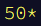
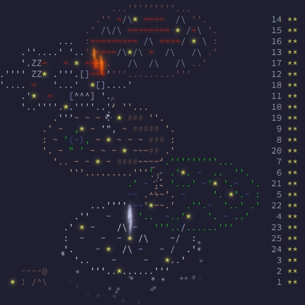
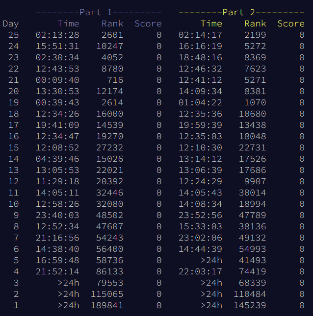

I've completed all of [this year's Advent of Code](https://adventofcode.com/2023/) puzzles!

This is a first for me. I've taken part in previous years' challenges, even gotten pretty close to finishing in a prior year, but this is the first time I've managed to do the whole thing. Advent of Code, if you're not familiar, is a series of programming challenges. It's explained pretty well [here](https://adventofcode.com/2023/about). There's an extremely active community on the [r/adventofcode](https://www.reddit.com/r/adventofcode/) subreddit.

And to be clear: I'm still an imposter. I didn't solve them _all_ on my own. I did solve _many_ of them myself with no need for reference material, and quite a few needing needing only minor use of some references to complete my solutions. I also got some help along the way with co-pilot, GPT-4, Code Llama, dolphin-mixtral, and other generative AIs.

In a few cases I needed to look to others' solutions to gain understanding of what I was doing wrong and occasionally adapt these solutions into something I could work with to solve my own input. I did not feed problems directly to into any LLMs, something I tried to do as an experiment last year without much success. (Well, I did exactly that, but only after solving them while trying to work on documenting my work to get summaries of the problems I'd worked on.)

Mostly I used generative AI as a rubber duck to great effect. [Mostly](/blog/dont-trust-ai-an-advent-of-code-tale/).

It was rather useful to treat GPT-4 like a coding partner, to let it help me produce visualizations more quickly than I would otherwise have been able to do on my own. It was nice to have Co-Pilot complete methods as I worked on them based on my comments and context.

Most of all, it was nice to actually stay on top of this year's puzzles and story. In years past, I have often found myself falling off due to time constraints - December is a notoriously busy month, and working on code puzzles can be a remarkably time-consuming pastime. I've wanted to get back to all the previous year's puzzles, but who has time for that?

This year, though, I managed to keep up quite well- even landing on the top 1,000 leader board for the first part of day 21:

I even found some time to work on different solutions in different languages on some of the “easier” days.

I even found some time to work on different solutions in different languages on some of the “easier” days. Early on, I did most of my solutions in JavaScript but eventually switched to focusing on getting more comfortable with Python, as it's just a much easier language to work with for these sorts of puzzles. I also found myself spending a bit more time with Rust and even managed to convert a couple of solutions to Elixir. I did none of them in PHP, despite it being (or perhaps _because_ it is) the language of my day job.

I feel good about getting all 50 stars this season, even if I didn't solve every puzzle “on my own,” as it were. I'm sure some purists might look down on my methods, solutions, or whatever - but I still did it, and I feel accomplished.

I'm certainly an imposter, as I've long admitted, but I'm a capable imposter all the same.

If you're curious, you can find my solutions through the first 19 days in a [folder on my Repl.it](https://replit.com/@ephbaum?path=folder/Advent%20of%20Code%202023). Then I stopped creating Repls and just uploaded my local code as different [gists](https://gist.github.com/ephbaum) and haven't bothered creating Repls for all of them. I also think I'm missing a day's worth of uploaded code, though I think it's on my main box.

Why didn't I just create a single AoC 2023 repo? That's actually a really good question that has a lot more to do with using several different computers and environments and, of course, wanting to use Repl.it as my repository when I started this journey near the beginning of the month.

Now that I'm thinking about it I should maybe just do that and circle back to this later... 🤔

Until then, let me conclude this post by again patting myself on the back for having managed to get all 50 stars for this year's Advent of Code challenge! It was an excellent challenge, a useful distraction, a nice reminder that I can still solve puzzles with code, and a great way to keep my programming skills sharp!
