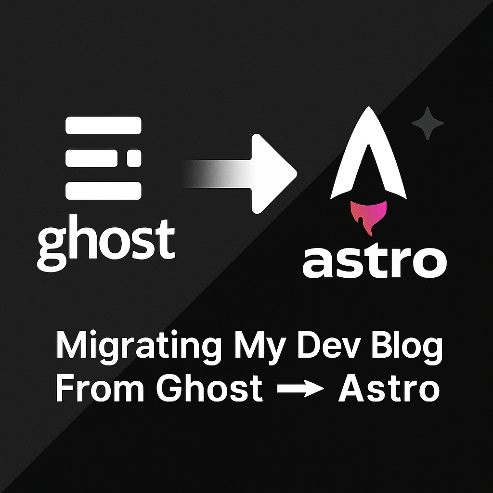

After years of running my personal blog on Ghost CMS hosted on Digital Ocean, I finally made the decision to migrate to a modern static site generator. This post documents the complete journey from Ghost CMS to Astro, hosted on Vercel.

## Why Migrate?

The decision to migrate wasn't made lightly. Ghost CMS had served me well for years, but several factors pushed me toward a static site approach:

- **Performance**: Static sites load faster and provide better Core Web Vitals
- **Cost**: Moving from a VPS to static hosting reduces ongoing costs
- **Maintenance**: No more server management, updates, or security patches
- **Developer Experience**: Modern tooling and deployment workflows
- **Flexibility**: Full control over the build process and customization

## The Migration Strategy

The migration involved several key phases:

1. **Content Export**: Extracting all posts, pages, and metadata from Ghost
2. **Backup Conversion Script**: Creating a custom script to convert Ghost backup JSON to markdown files
3. **Image Migration**: Preserving all original images and their relationships
4. **Template Conversion**: Converting Ghost themes to Astro components
5. **Deployment Setup**: Configuring Vercel for static site hosting
6. **SEO Preservation**: Maintaining all URLs and meta data
7. **Final Cleanup**: Restoring placeholder images and ensuring everything works

## The Ghost Backup Conversion Script

One of the most critical components of the migration was creating a custom script to convert the Ghost backup JSON export into properly formatted markdown files. This work actually began much earlier than the main migration effort.

### The Original Solution (October 2023)

Back in October 2023, I published a detailed post about creating a [Ghost Blog backup to Astro markdown conversion script](https://ephbaum.dev/blog/ghost-blog-backup-to-astro-markdown). This post documented my initial research and the custom Node.js solution I developed to solve the migration problem.

The original script was created because I couldn't find any existing tools that would help migrate from Ghost to Astro. The available options were either outdated (last updated in 2019) or incomplete. So I built my own solution using:

- **Turndown**: For converting HTML content to clean markdown
- **Custom JSON parsing**: To extract posts, pages, and metadata from Ghost backups
- **Automated frontmatter generation**: Creating proper YAML headers for each post
- **Image URL mapping**: Converting Ghost image references to local paths

This script served as the foundation for the entire migration process and was essential for automating the conversion of dozens of blog posts.

### The Migration Implementation

The script I developed in 2023 handled all the critical aspects of the conversion:

- **JSON Parsing**: Extracting all blog posts, pages, and metadata from the Ghost backup
- **Markdown Generation**: Converting HTML content to clean markdown format
- **Frontmatter Creation**: Generating proper YAML frontmatter with all necessary fields
- **Image URL Mapping**: Converting Ghost image URLs to local asset references
- **Slug Generation**: Creating URL-friendly slugs from post titles
- **Date Formatting**: Converting Ghost timestamps to readable date formats
- **Tag Processing**: Extracting and formatting post tags and categories

This script was essential for automating the conversion of dozens of blog posts, ensuring consistency in formatting and preventing manual errors that would have been time-consuming to fix later. The work I did in October 2023 laid the groundwork for the entire migration process that would follow over the next two years.

## The Final Mile: Image Restoration

*[This section documents the work completed on October 7, 2025]*

The last step of the migration involved restoring all the placeholder images that had been temporarily used during the transition. This turned out to be a more systematic process than expected.

### The Problem

During the initial migration, all Ghost CMS image URLs (using the `__GHOST_URL__` placeholder) were replaced with `placeholder.com` images to prevent build failures. While this allowed the site to build successfully, it left 13 placeholder images across 7 blog posts that needed to be restored.

### The Solution

Using git history analysis, I was able to trace each placeholder back to its original Ghost CMS URL and then locate the corresponding image in the migrated assets directory. The process involved:

1. **Systematic Discovery**: Found all 13 placeholder images across 7 blog posts
2. **Git History Analysis**: Extracted original Ghost CMS URLs from commit history
3. **Asset Verification**: Confirmed all original images existed in `/src/assets/img/`
4. **Path Restoration**: Updated all markdown files with correct relative paths

### The Results

**Files Processed**: 7 blog posts  
**Images Restored**: 13 total placeholder images  
**Success Rate**: 100% - All images found and restored

The migration was actually perfect - all original images were successfully migrated to the local assets directory with the exact same hash filenames. The only issue was that the image paths in the markdown files were replaced with placeholders instead of being updated to point to the local assets.

### Technical Details

All images now use proper relative paths in the format:
```markdown

```

The original Ghost CMS URLs followed the pattern:
```
__GHOST_URL__/content/images/YYYY/MM/[hash].ext
```

And were successfully mapped to:
```
../../../../assets/img/YYYY/MM/[hash].ext
```

## The Complete Timeline

The migration journey actually spanned over 2 years, with the initial work beginning in October 2023 and the final completion in October 2025. Here's the complete timeline:

### 🔧 Phase 1: Initial Research & Script Development (October 2023)
**October 9, 2023** - *The Foundation*
- **October 9**: Published "[Ghost Blog backup to Astro markdown](https://ephbaum.dev/blog/ghost-blog-backup-to-astro-markdown)" post
- **October 9**: Created custom Node.js script to convert Ghost backup JSON to markdown
- **October 9**: Implemented Turndown integration for HTML to markdown conversion
- **October 9**: Developed solution for automated post migration with proper frontmatter generation

### ⏸️ Phase 2: Development Pause (October 2023 - May 2024)
**~7 months** - *Script development complete, project on hold*

### 🚀 Phase 3: Initial Setup & Migration (May 2024)
**May 3-5, 2024** - *The Foundation*
- **May 3**: `init Astro` - Started the Astro project
- **May 3**: `taking credit for my own site / blog` - Began customization
- **May 4**: Multiple setup commits - README, structure, content migration
- **May 5**: `copy postSlug and value to slug in frontmatter` - Fixed frontmatter issues
- **May 5**: `replace broken Ghost image references with placeholders` - **First placeholder fix attempt**

### ⏸️ Phase 4: Development Pause (May 2024 - October 2025)
**~17 months** - *Project on hold*

### 🔥 Phase 5: Intensive Development & Completion (October 2025)
**October 5-7, 2025** - *The Final Push*

#### October 5, 2025 - *Infrastructure & Security*
- `fix: resolve TypeScript errors in OG image generation`
- `fix: replace broken Ghost image references with placeholders` - **Second placeholder attempt**
- `chore: add asdf tool versions configuration`
- `security: update Astro to 4.16.19 to fix critical vulnerabilities`

#### October 6, 2025 - *Documentation & Legal*
- `docs: comprehensive README update`
- `docs: integrate brutalist theme documentation with customizations`
- `legal: add comprehensive copyright and licensing information`
- `docs: add comprehensive deployment plan for GitHub Actions + Firebase`

#### October 6, 2025 - *UI/UX Enhancements*
- `feat: enhance footer with copyright notice and GitHub link`
- `Update page titles to use consistent 'eph baum dot dev' format`
- `feat: add dynamic color change button with random background colors`
- `feat: add Vercel deployment configuration`

#### October 6, 2025 - *Dynamic Color System*
- `feat: implement dynamic color system with palette button`
- `feat: implement comprehensive dynamic color system`
- `refactor: clean up dynamic color system for production`

#### October 7, 2025 - *Content & Migration Completion*
- `chore: update redirect in project settings`
- `feat: Add engaging preview descriptions to all blog posts`
- **`feat: complete Ghost CMS to Astro migration - restore all placeholder images`** - **🎉 MIGRATION COMPLETE!**
- **`feat: add blog post generator script`** - **🛠️ Developer tooling added**

### 📊 Key Statistics:
- **Total Timeline**: ~2 years (October 2023 - October 2025)
- **Active Development**: 4 days total (October 9, 2023 + October 5-7, 2025)
- **Total Commits**: 40+ commits
- **Major Milestones**: 
  - ✅ Ghost backup conversion script created (October 2023)
  - ✅ Ghost CMS migration completed (May 2024)
  - ✅ All placeholder images restored (October 2025)
  - ✅ Dynamic color system implemented (October 2025)
  - ✅ Vercel deployment configured (October 2025)
  - ✅ Blog post generator created (October 2025)

## What's Next?

*[This section will be filled in with the broader migration efforts]*

The image restoration marks the completion of the Ghost CMS to Astro migration. The blog is now:

- ✅ Fully self-contained with no external dependencies
- ✅ Hosted on Vercel with automatic deployments
- ✅ Optimized for performance with static generation
- ✅ All original content and images preserved
- ✅ Modern development workflow with Astro

## Lessons Learned

*[This section will be expanded with insights from the full migration process]*

The migration process taught me several valuable lessons about content migration, image handling, and the importance of systematic approaches to complex technical tasks.

## Conclusion

*[This section will be completed with final thoughts on the migration]*

The migration from Ghost CMS to Astro represents a significant modernization of the blog infrastructure while preserving all the valuable content and images that have been created over the years.

---

*This post documents the complete migration journey from Ghost CMS on Digital Ocean to Astro hosted on Vercel, completed on October 7, 2025.*
