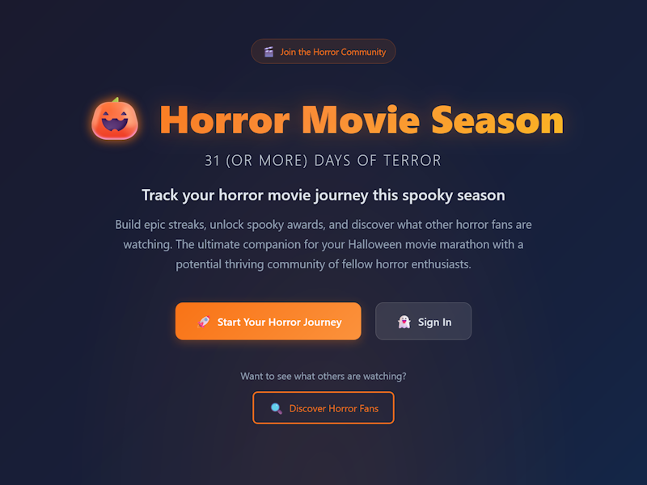
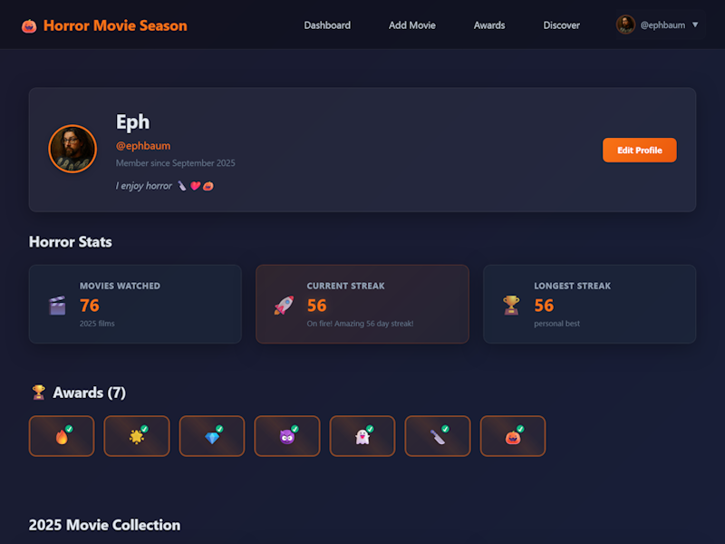

_How I built a production web app primarily through "vibe coding" with Claude, and what it taught me about the future of software development_

---

## Introduction

After years of using LLMs to assist with my work—both personally and professionally—I recently released my first project that was primarily "vibe coded" with AI assistance. As a professional engineer, this represents the least amount of direct code I've written and edited in any project I've shipped. But it's also one of the most complete applications I've built.

The project? [Horror Movie Season](https://horrormovieseason.com) — a SvelteKit app for tracking you horror movies during horror movie season (generally starting as fall sets in and lasting until October 31st), complete with gamification, streaks, awards, and social features.

This post explores what it means to build a "production app" with extensive LLM assistance, particularly at a time when newer models seem to be getting demonstrably worse rather than better (since around the GPT-3 and Claude 3/3.5 era, each iteration was an improvement, but that trend appears to have reversed in more recent iterations).

If you're curious, you can check out my [public profile](https://horrormovieseason.com/user/ephbaum) and see what I've watched (so far) this Horror Movie Season.

<aside class="bg-yellow border-4 border-black p-4 my-6 rounded-lg">
  <h4 class="font-bold text-lg mb-2">📝 Note For Future Readers</h4>
  
I may create some kind of archive or do something to make each "season" unique and evolve this system. Forgive me if this profile link doesn't work any more as a result, feel free to reach out or throw a PR my way to update this post if that ends up the case.

</aside> 

## The Concept

The idea was simple: I wanted to try building something with Svelte. Most of my recent projects have been built with Astro, but I was curious about Svelte's approach—it feels like OG HTML/CSS/JS meets modern components, which appealed to me.

The goal was to create a Firebase-hosted app without a traditional backend, focusing on the "31 Days of Horror" challenge that many horror movie fans participate in during October. The app needed to track daily movie watches, calculate streaks, award badges, and include social features for discovering other horror fans.

I love film and horror is my favorite genre. I believe I've written about it before but there's something about the storytelling goal of scaring someone, something about the way in which someone might dig deep into their own depravity to create a story that shocks, that causes gooseflesh, or disgusts.

## The "Vibe Coding" Experience

### What Vibe Coding Actually Means

"Vibe coding" is a term popularized by Andrej Karpathy (co-founder of OpenAI and former AI leader at Tesla) in February 2025, and it's even made it into [Merriam-Webster's dictionary](https://www.merriam-webster.com/slang/vibe-coding). The term has hit the zeitgeist by storm, permeating LinkedIn, blogs, YouTube, news, and the Internet at-large. It describes the experience of simply telling an LLM what you want to build and letting the AI handle the majority of implementation details from there. It's not just AI-assisted coding — it's AI-driven development where you act more as an architect, reviewer, and decision-maker than as the primary implementer.

This is somewhat fascinating to me because it mirrors my professional experience. As experienced senior engineer and technical lead, my role has often been less hands on keyboard. Depending on the team and project I work on I've often spent more of my time reviewing code, making architectural decisions, and guiding implementation.

In my personal projects, that's obviously not the case. When I work on a personal project I'm usually doing everything. Even in cases where I'm collaborating with others, where I might still be guiding and decisioning, I'm still often much closer to direct implementaiton.

With AI-assisted development, that dynamic flipped. In this project I found myself in the same role I often have professionally — reviewing implementations, making architectural decisions, and guiding the overall direction — yet I'm alone, it's just me.

### The Dangers and Balance Required

This approach isn't without risks. Vibe coding can be dangerous when you're trying out technologies you don't have deep experience with. Without the knowledge to effectively review the AI's output, you might miss subtle bugs, performance issues, or architectural problems.

The balance required is significant. You need enough domain knowledge to:

- Make informed architectural decisions
- Spot potential issues in the AI's implementations
- Know when to intervene vs. when to trust the AI
- Maintain consistency and quality across the codebase

In this project I felt that I wasn't wasn't working without a net. As I mentioned earlier, Svelte, to me, feels rather approachable, and I have extensive Javascript experience. Additionally, I've used Firebase for years, since well before it became a Google Property, and it is not dissimilar to other hosting services with which I've experience such as heroku, and vercel.

I still missed plenty of issues during the process and have had to circle back on numerous bugs and issues. Many remain.

## Technical Journey

### Why Svelte?

Svelte appealed to me because it felt like a return to fundamentals—HTML, CSS, and JavaScript—but with modern component architecture. Unlike React's JSX or Vue's template syntax, Svelte components feel more like enhanced HTML with reactive statements and component logic.

The compilation approach also intrigued me. Svelte compiles to vanilla JavaScript, which should result in smaller bundles and better performance than frameworks that ship a runtime.

**What makes Svelte different:**

- **No Virtual DOM**: Svelte compiles away the framework at build time, updating the DOM directly when state changes
- **Reactive by default**: Variables automatically update the UI when they change—no `useState` or `ref` needed
- **Scoped styles**: CSS in components is automatically scoped, preventing style conflicts
- **Built-in animations**: Rich animation and transition system without additional libraries
- **Smaller bundle sizes**: Since there's no runtime, the compiled output is typically smaller than React or Vue apps

For this project, Svelte's approach felt natural. The component syntax is clean and readable, the reactivity system is intuitive, and the compilation output is efficient. It's particularly well-suited for apps that need to be fast and lightweight—perfect for a movie tracking app that users might access frequently during October.

### Firebase Architecture

The entire backend runs on Firebase's free tier:

- **Authentication**: Firebase Auth for user management
- **Database**: Firestore for real-time data sync
- **Functions**: Cloud Functions for secure API calls (OMDb integration)
- **Hosting**: Firebase Hosting for static site deployment

The key architectural decision was using SvelteKit's static adapter, which generates a single-page application that Firebase Hosting can serve with proper routing.

### Key Technical Decisions

**Static Adapter for Firebase Hosting**: This allows the SvelteKit app to be deployed as a static site while maintaining client-side routing. The `firebase.json` configuration handles all routes by serving `index.html`, letting SvelteKit's router handle the rest.

**Firestore Schema Design**: Optimized for Firebase's free tier limits, with careful attention to read/write operations and query patterns. The schema includes users, movies, awards, and social features while staying within free tier constraints.

**OMDb API Integration**: Rather than exposing the API key on the client, I used Firebase Cloud Functions to proxy requests to the OMDb API. This keeps the API key secure while providing movie search functionality.

**Real-time Streak Calculation**: The streak logic calculates consecutive days of movie watching, with proper timezone handling and edge case management for the horror season (October 1-31).

## Development Process

### Starting from Scratch with AI

The project began with a simple prompt: "I want to build a horror movie tracking app with SvelteKit and Firebase." From there, Claude helped me:

1. Set up the initial SvelteKit project structure
2. Configure Firebase integration
3. Design the Firestore schema
4. Implement authentication flows
5. Build the core movie tracking features

### Iterative Feature Building

The git history tells the story: 266 commits showing the iterative development process. Features emerged organically:

- **Core MVP**: User auth, movie search, basic tracking
- **Gamification**: Streak calculation, progress tracking
- **Social Features**: Public profiles, user discovery
- **Awards System**: Badges for streaks, themed challenges
- **Advanced Features**: Movie editing, advanced search, notifications

### Evolution from MVP to Full-Featured App

What started as a simple movie tracker evolved into a comprehensive social platform. The AI helped implement complex features like:

- **Awards System**: 8 different badges across streak, challenge, and themed categories
- **Social Discovery**: User search, public profiles, follow system
- **Advanced Search**: Multiple search modes including exact title and IMDb ID lookup
- **Real-time Updates**: Instant UI updates across dashboard and public profiles

## What Worked Well

### Rapid Prototyping and Iteration

The speed of iteration was remarkable. I could describe a feature and have a working implementation within minutes. This allowed for rapid experimentation and feature exploration.

### Comprehensive Documentation Generation

The AI excelled at generating documentation. The project includes 15+ documentation files covering everything from environment setup to security implementation to the awards system logic.

### Testing and Quality Tooling Setup

Setting up a complete testing and quality pipeline was straightforward. The AI helped configure Vitest for testing, ESLint for linting, Prettier for formatting, and GitHub Actions for CI/CD.

### Complex Business Logic Implementation

Surprisingly, the AI handled complex business logic well. The streak calculation algorithms, award detection logic, and social features were implemented easily enough.

There had to be some tweaking throughout the process and it's still not all working flawlessly, there are a few bugs I still want to squash, but I'm generally happy with how it turned out and have ideas for improvments going forward.

## Challenges and Learnings

### When to Intervene vs. Trust the AI

One of the biggest challenges was knowing when to step in. Sometimes the AI would implement something that looked correct but had subtle issues. Other times, it would over-engineer a solution when something simpler would work.

Occassionally the LLM would go rogue and just start doing things.

One of the biggest challenges with using Cursor is that it's hard to strike a balance between allowing it to use its tools unfettered and having to hold its hand to approve each tool call so that it doesn't decided to deploy to your production environemnt while working on a feature brannch. (Yes, this actually happened)

### Maintaining Architectural Vision

Without writing the code yourself, it's easy to lose sight of the overall architecture. I had to be more deliberate about reviewing the codebase structure and ensuring consistency.

### Code Quality and Consistency

While the AI generally produced good code, maintaining consistency across the codebase required active review. Different prompts could lead to different coding styles or patterns, as could using Cursor's Auto mode which results in the use of different models.

Cursor's output has been reasonably consistent overll, it's impressive to see where we are today with this tool, particularly when I compare Cursor with Github's Co-pilot, which is probably the topic for a whole other post, I'm sure.

### The Importance of Good Prompting

The quality of the output was directly related to the quality of the prompts. Vague requests led to generic implementations, while specific, detailed prompts produced better results.

Largely, however, I find that a relatively coversational tone works pretty well.

Interestingly, calling out LLms for bad behavior tends to be surprisingly effective, although it becomes clear just how sycophantically they've been desiged in this case.

## Reflections

### Would I Do It Again?

I think it requires a lot of balance. The approach works well when you have enough domain knowledge to effectively review the AI's output. It's somewhat dangerous when trying out technologies without experience to be an effective reviewer.

The key is knowing your limits and being honest about what you can and cannot effectively review. Interestingly, LLMs can actually help here, using adversarial prompting you can get it to be really critical of itself and that can often uncover possible issues you might not catch otherwise.

### What This Means for Software Development

AI is not replacing humans anytime soon. It's useful augmentation, but it requires human oversight, architectural thinking, and domain expertise to be effective.

The role of the engineer in AI-assisted development is evolving. We're becoming more like conductors of an orchestra—guiding, reviewing, and making high-level decisions while the AI handles much of the implementation.

I am still predicting that there will soon be plenty of work to undo the AI-slop being yeeted out in companies trying to adopt early without implemnnting appropriate guardrails.

### Transparency About AI Usage

I believe in being transparent about AI usage in open source projects. The Horror Movie Season repository includes extensive documentation about the development process, and this blog post is part of that transparency. I'll be cross posting this to my development blog, but this file will live in the repo as well.

## Conclusion

The result is a mostly-functional, well-documented app deployed at [horrormovieseason.com](https://horrormovieseason.com). With 266 commits, comprehensive documentation, a full test suite, CI/CD pipeline, and 95% feature completion, it represents what's possible with AI-augmented development.

The experience has been eye-opening. It's shown me both the potential and the limitations of AI-assisted development. While the speed and capability are impressive, the need for human oversight, architectural thinking, and domain expertise remains critical.

As we move forward, I think the most successful developers will be those who can effectively collaborate with AI while maintaining the skills to review, guide, and make architectural decisions. The future isn't about AI replacing developers—it's about developers who can work effectively with AI.

If you're curious about the implementation details, the code is available on GitHub in my Bombing Around org, but I have not made the code generally available (for reasons I hope are obvious after reading this post). The documentation in the repository provides a comprehensive look at the development process and technical decisions and my hope is to clean things up and make the repository public in the future and share the source.

For now, you can try the app at [horrormovieseason.com](https://horrormovieseason.com).

The future of development is collaborative, as is its past, but the collaboration will be changing now in. It's going to be interesting to see where this journey takes us. Much has been predicted and discussed about the seachange that LLMs are creating, the future doesn't seem clear, and it seems that "AI" is already resulting in a lot of changes in the present. 

---

_What are your thoughts on AI-augmented development? Have you tried "vibe coding" on any projects? I'd love to hear about your experiences and insights._
