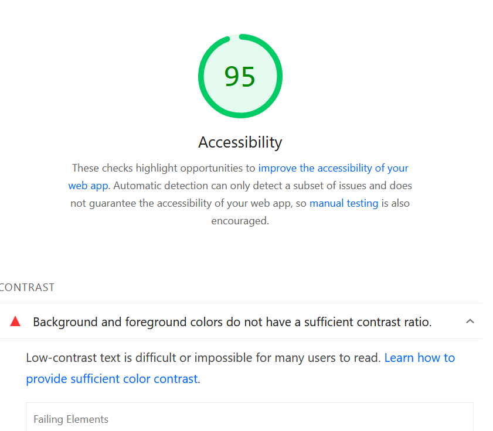

# Making Brutalist Design Accessible: A Journey in WCAG AA Compliance

When I adopted the brutalist theme I was drawn to its bold, unapologetic aesthetic — bright colors, sharp edges, and at least a little bit of nostaligia for early web design. The issue, of course, as I worked to make it my own, is that I worried first about making it look the way that I want first before worring about accessibility.



This is particularly problematic for me because I really do care quite a bit about a11y, so the realization that I was actually close to meeting folks' needs was simulataneously disappointing and pleasing.

Thankfully [PageSpeed Insights](https://pagespeed.web.dev/) let me know where I was letting folks down (more than just having mediocre, poorly written, content).

## The Problem: Beautiful but Inaccessible

My brutalist theme features a dynamic color system that randomly assigns bright colors to backgrounds, cards, and text elements. While visually striking, this approach had a flaw: it didn't ensure sufficient contrast between text and backgrounds.

The [Web Content Accessibility Guidelines (WCAG)](https://www.w3.org/WAI/WCAG21/quickref/?versions=2.1&levels=aa) specify that text must have a contrast ratio of at least 4.5:1 for normal text and 3:1 for large text (18pt+ or 14pt+ bold) to meet AA standards. My random color assignments often failed this test, making content difficult or impossible to read for users with visual impairments.

## The Challenge: Maintaining Aesthetic While Ensuring Accessibility

The core challenge was maintaining the brutalist aesthetic — random, vibrant colors — while ensuring every color combination met accessibility standards. I didn't want to abandon the dynamic color system entirely, but I needed to make it intelligent.

## The Solution: Smart Color Selection

I implemented a comprehensive accessibility system with three key components:

### 1. Contrast Calculation Engine

First, I built a utility that calculates contrast ratios using the WCAG relative luminance formula:

```javascript
function getContrastRatio(color1, color2) {
  const lum1 = getRelativeLuminance(hexToRgb(color1));
  const lum2 = getRelativeLuminance(hexToRgb(color2));
  const lighter = Math.max(lum1, lum2);
  const darker = Math.min(lum1, lum2);
  return (lighter + 0.05) / (darker + 0.05);
}
```

This engine can determine if any color pair meets WCAG AA standards and find accessible alternatives from my existing palette.

### 2. Intelligent Color Filtering

Instead of completely random color selection, I modified the system to filter out inaccessible combinations:

- **12 out of 16 colors** in my palette work with black text (75% success rate)
- **Accessible colors**: red, green, yellow, pink, orange, cyan, lime, emerald, fuchsia, rose, sky, amber
- **Filtered out**: blue, purple, teal, violet (too dark for black text)

The system now randomly selects from only the accessible colors, maintaining the random aesthetic while ensuring readability.

### 3. High Contrast Mode Support

For users who need even higher contrast, I added automatic detection of the `prefers-contrast: high` media query:

```css
@media (prefers-contrast: high) {
  * {
    color: #000000 !important;
    background-color: #ffffff !important;
  }
  
  [class*='i-uil-'], [class*='i-'], svg, .icon {
    color: #000000 !important;
    background-color: #000000 !important;
  }
}
```

This provides a clean black-on-white experience when users have high contrast enabled in their system settings.

## Technical Implementation Details

### Color Pair Validation

For colored text scenarios (like author badges), I created a system that finds valid color pairs:

```javascript
function findAccessibleTextPairs(colors, colorMap) {
  const accessiblePairs = [];
  
  colors.forEach(textColorName => {
    colors.forEach(bgColorName => {
      if (textColorName !== bgColorName && 
          meetsWCAGAA(textColorHex, bgColorHex, false)) {
        accessiblePairs.push({
          foreground: textColorHex,
          background: bgColorHex,
          ratio: getContrastRatio(textColorHex, bgColorHex)
        });
      }
    });
  });
  
  return accessiblePairs.sort((a, b) => b.ratio - a.ratio);
}
```

### Icon Accessibility

UnoCSS icons posed a unique challenge—they use CSS masks with `background-color: currentColor`. In high contrast mode, I had to ensure both the color and background-color properties were set correctly:

```css
[class*='i-uil-'], [class*='i-'], svg, .icon {
  color: #000000 !important;
  background-color: #000000 !important; /* Critical for mask visibility */
}
```

### Footer Integration

Another area I'd initially overlooked was the footer links. The original design used blue links (`text-blue`) against a black background, which also failed contrast requirements. I integrated the footer into the color system by:

```javascript
function applyFooterColors() {
  const footer = document.querySelector('[data-brutal-footer]');
  const footerLinks = footer.querySelectorAll('a');
  
  footerLinks.forEach((link) => {
    const linkColor = getRandomAccessibleColorExcluding();
    link.classList.add(`text-${linkColor}`);
    link.style.color = colorMap[linkColor];
  });
}
```

This ensures footer links (GitHub, Buy Me a Kombucha, RSS feed) use accessible colors from the palette while maintaining the brutalist aesthetic.

## Results: Accessibility Without Compromise

The implementation successfully achieves:

- ✅ **WCAG AA Compliance**: All text meets 4.5:1 contrast ratio minimum
- ✅ **Preserved Aesthetic**: Still random and vibrant, just with accessibility constraints
- ✅ **Automatic Fallbacks**: High contrast mode activates automatically
- ✅ **No Manual Toggles**: System handles accessibility intelligently
- ✅ **Performance**: Minimal overhead, utilities load once and cache results

## Lessons Learned

### 1. Accessibility Can Enhance Design

Rather than constraining creativity, accessibility requirements forced me to think more carefully about color relationships. The result is a more sophisticated color system that's both beautiful and functional.

### 2. Progressive Enhancement Works

The system gracefully degrades—if contrast utilities fail to load, it falls back to safe defaults. This ensures accessibility even when JavaScript fails.

### 3. User Preferences Matter

The `prefers-contrast: high` media query is a powerful tool that respects user preferences without requiring manual configuration.

## The Broader Impact

This work demonstrates that accessibility and aesthetic design aren't mutually exclusive. By implementing smart color selection algorithms, we can create visually striking designs that work for everyone.

The brutalist aesthetic—with its bold colors and unapologetic style—can coexist with inclusive design principles. The key is making the randomness intelligent rather than purely chaotic.

## Next Steps

While this implementation achieves WCAG AA compliance, there's always room for improvement:

- **WCAG AAA**: Could target the higher 7:1 contrast ratio for enhanced accessibility
- **Color Blindness**: Could add support for different types of color vision deficiency
- **Dynamic Adaptation**: Could adjust contrast based on ambient light conditions

## Conclusion

Making my brutalist blog accessible wasn't about compromising the design — it was about making it smarter. By implementing intelligent color selection algorithms and respecting user preferences, I created a site that maintains its bold aesthetic while ensuring everyone can read the content.

The result is a more inclusive web that doesn't sacrifice creativity for accessibility. Sometimes, constraints lead to better solutions.

---

*Have you implemented accessibility improvements in your designs? What challenges did you face? I'd love to hear about your experiences with inclusive design.*
