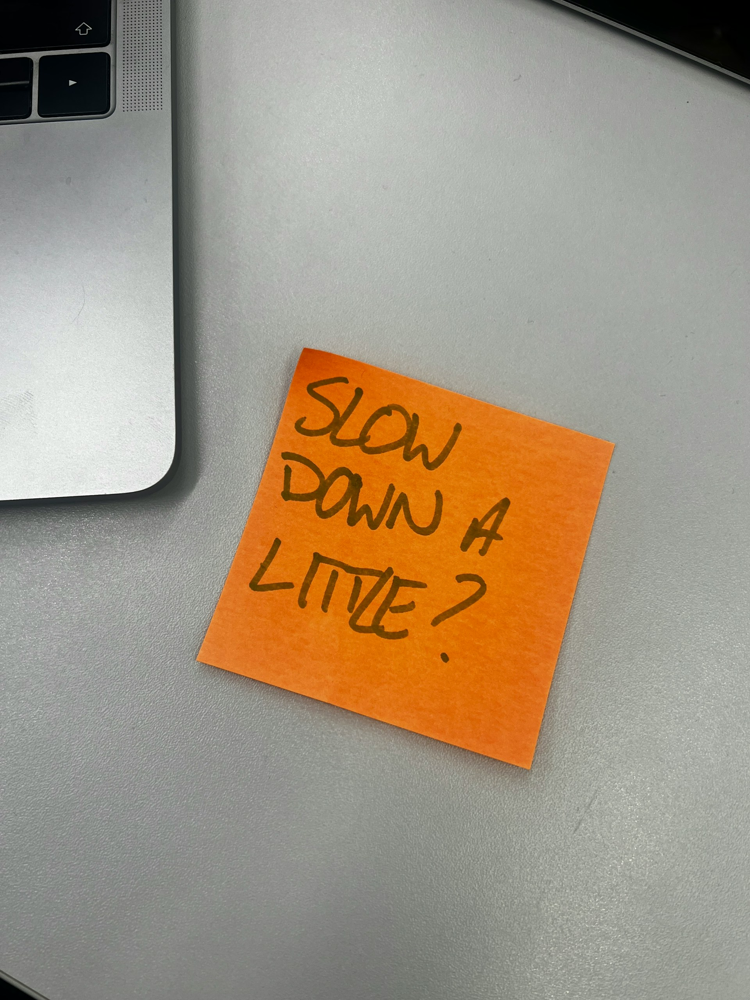

## Nobody Wants to Hear This

Slow down.

That's it. That's the post. But since you're still reading — probably because some part of you knows I'm right and another part wants to argue about it — let's get into it.

Open LinkedIn on any given day and you'll drown in people preaching the gospel of speed. Move fast. Fail fast. Iterate fast. Win the race. Beat the competition. Get there first. The hustle is relentless and the rhetoric is exhausting.

What you almost never hear is this: **going fast is often how you screw everything up.**

Photo by <a href="https://unsplash.com/@fhdigital?utm_source=unsplash&utm_medium=referral&utm_content=creditCopyText">Hannah Fleming-Hlll</a> on <a href="https://unsplash.com/photos/a-piece-of-orange-paper-with-the-words-slow-down-4-little-written-on-it-ANkZdIsGpHM?utm_source=unsplash&utm_medium=referral&utm_content=creditCopyText">Unsplash</a>

---

## We Already Knew This

Here's the thing that genuinely baffles me. We all grew up hearing the same stories, learning the same lessons. The Tortoise and the Hare. Slow and steady wins the race. We sat in classrooms with crayons and colored pencils, carefully trying to stay inside the lines, and when we drifted outside them, a teacher would lean down and say: *Take your time. It's okay. There's no rush.*

Then we enter the workforce, and every single one of those lessons evaporates.

Suddenly carefulness is timidity. Thoroughness is slowness. Taking your time means you're falling behind. The entire professional world seems to have collectively agreed to forget everything it learned before age eighteen.

---

## The Fail-Fast Cult

I've seen posts — genuinely unhinged posts — from people on LinkedIn celebrating the virtues of failing over and over again as fast as possible until something sticks. And I keep thinking: do you have any idea how much time and energy you're burning by running headlong into the same wall repeatedly? What if you just... looked at the wall first?

Now, before anyone comes at me with the iterative development speech — I know. I've worked in agile for years. I believe in it. Small incremental steps toward a goal are genuinely valuable. Progress requires movement.

But agile isn't an excuse to sprint blindly. The whole point is that you *stop*. You retrospect. You ask what's working, what isn't, what needs to change. The sprint is only half the methodology. The reflection is the other half — and it's the half that most speed-obsessed people quietly skip.

Taking time to examine your own process isn't weakness or waste. Treating it like folly is how teams spend six months going very fast in the completely wrong direction.

---

## It's Not Even a Race

Going faster doesn't mean going better. Going faster doesn't mean you'll win.

And honestly? Most of the time, **it isn't even a competition.**

That's the part nobody seems to want to sit with. The framing of everything as a race — as something to be *won* against someone else — is what drives the speed worship in the first place. Once you let go of that, the pressure to move recklessly starts to look like what it actually is: anxiety wearing a productivity costume.

Take your time. Plan your steps. Look where you're going.

It's okay. There's no rush.